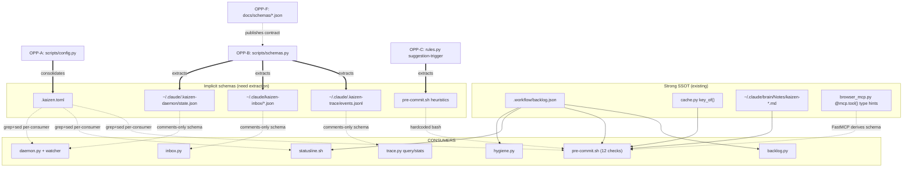

# Schema-Driven Development & SSOT — applied to the kaizen plugin

> **Status**: drafted 2026-05-12. Mirrors the analysis lens of `shodan/docs/schema.md` (Opsmill + Godspeed + noclocks.dev sources) applied to kaizen's own surface area. No tables — bullets + inline labels per [[Notes/pref-no-tables-in-responses]].

---

## Lens recap (1 paragraph)

**SDD** uses one schema definition as the blueprint that generates everything downstream — validation, docs, clients, tests. **SSOT** means each concept lives in exactly one place; every consumer references that single source. Together they replace "we agree to do it this way" (convention) with "the system won't let you do it any other way" (guardrail). For kaizen — a discipline plugin — every artifact the plugin produces or consumes is a candidate schema target.

---

## Part 1 — kaizen artifacts surveyed

The kaizen plugin touches roughly 15 distinct data shapes. For each, two questions: **is the shape defined in one place** (SSOT), and **do all consumers derive from that one place** (SDD)?

### 1.1 `.workflow/backlog.json` — Strong SSOT ✅

- **Source**: `<repo>/.workflow/backlog.json`. Authoritative JSON envelope (`schema_version`, `kind: kaizen.backlog`, `items[]`, `decisions[]`, `metadata`).
- **Consumers**: `backlog.py list/add/start/tick/park/decision/render/verify`, statusline (`scripts/statusline.sh`), pre-commit gate Check #10, daemon hygiene's `backlog` check.
- **Derived artifact**: `.workflow/backlog.md` — generated via `backlog.py render`. Hand-editing `.md` is corruption; the gate detects drift via `backlog.py verify`.
- **Where it shines**: this is the single cleanest SDD/SSOT pipeline in kaizen. The `.json → .md` flow is exactly the shodan `SchemaSync → MigrationWriter` pattern at lower fidelity.
- **Remaining gap**: there's no `JsonSchema`-style formal contract published anywhere. The shape lives in `backlog.py`'s `empty_store()` function + the keys hard-coded across consumers. Adding a Pydantic model (or stdlib `dataclass` with `__init_subclass__` validation) plus a generated `docs/backlog-schema.json` would close it.

### 1.2 `.kaizen.toml` — Weak SSOT ⚠️

- **Source**: per-repo `.kaizen.toml`. Keys: `compile_check_cmd`, `verify_cmd`, `backlog_path`, `architecture_log`.
- **Consumers**: `pre-commit.sh` (greps `^backlog_path`, `^compile_check_cmd`, etc. with regex), `install.sh` (writes initial state), `statusline.sh` (also greps).
- **Gap**: every consumer reimplements TOML parsing as a bash regex. There's no `kaizen.toml` Python helper that all callers share. Three call sites each do `grep -E '^backlog_path' "$config" | sed -E 's/^[^=]*=[[:space:]]*"?([^"]*)"?.*$/\1/'`. If the schema gains a new key, every call site has to be updated independently.
- **Fix shape**: `scripts/config.py` that all consumers call (bash via subprocess, Python via import). Becomes the SSOT for `.kaizen.toml` parsing.

### 1.3 `~/.claude/.kaizen-trace/events.jsonl` — Implicit SSOT ⚠️

- **Source**: JSONL. Each line: `{ts, src, evt, sid, tool, ms, data}`. Written by `trace.py event`.
- **Consumers**: `trace.py query/stats/tail`, in-doc references in `commands/trace.md`.
- **Where the schema is defined**: comments at the top of `trace.py`. There's no executable schema definition.
- **Gap**: the schema lives in prose. A consumer that wants to validate or filter by a specific `evt` value has to read the comment to know valid `evt` names. There's no machine-readable list of "valid src values" (`hook | agent | llm | tool | user | cc | plugin`) anywhere.
- **Fix shape**: `scripts/trace_schema.py` (or a sidecar `events.schema.json`) — declare the record shape with allowed enums for `src` and conventional names for `evt`. Auto-validate on `trace.py event` for typo prevention.

### 1.4 `~/.claude/kaizen-inbox/<ts>-<seq>.json` — Implicit SSOT ⚠️

- **Source**: per-message JSON files. Schema: `{ts, session_id, prompt, drained, drained_at}`.
- **Consumers**: `inbox.py capture/list/peek/drain/clear/stats`, daemon hygiene's `inbox` check.
- **Gap**: same as trace — schema is comment-only. The `drained_at` field's nullability is implied. The expected `ts` format (`"2026-05-12T22:50:12.123Z"`) is example-only.

### 1.5 `~/.claude/.kaizen-daemon/state.json` — Implicit SSOT ⚠️

- **Source**: `daemon.py` writes it. Schema: `{runs, last_run, source_hash, cache_hash, local_sha, remote_sha, actions: {refresh-cache, pull, hygiene, ...}}`.
- **Consumers**: `daemon.py status`, `daemon.py tick`, watcher initial-state recovery.
- **Gap**: the same code that produces is the only code that consumes; refactor risk is low but external tooling (a status dashboard, an external scrape) has no contract to read against.

### 1.6 `<repo>/.kaizen/cache/<key>.json` — Strong SDD ✅

- **Source**: SHA1-hashed key + arbitrary JSON value. `cache.py key_of(*parts)` is the SSOT for key derivation.
- **Consumers**: `pre-commit.sh` (compile-barrier verdict cache), agent verdicts (documented but not yet auto-wired), `cache.py stats/clear/get/put`.
- **Where it shines**: the *key derivation* is genuinely centralized — anyone wanting to cache something only has to call `key_of()`. The *value shape* is per-caller, intentionally untyped (it's a generic JSON cache).
- **Minor gap**: cache values per call-site could declare their own schema (e.g. compile-barrier verdict is always `{status: "pass"|"fail", cmd: str}`) — a thin `cache_compile_barrier.py` module would make that contract explicit and prevent silent shape drift.

### 1.7 `.claude-plugin/plugin.json` — Externally-defined schema (Claude Code) ✅

- **Source**: this file. Schema owned by Claude Code's plugin loader, not kaizen.
- **Consumers**: Claude Code's `/plugin install/update/reload-plugins`.
- **Note**: this is one of the only artifacts where kaizen is the *consumer* of an external schema, not the producer. No gap to address from kaizen's side; we just have to respect the upstream contract.

### 1.8 `.mcp.json` — Externally-defined schema (Claude Code) ✅

- Same shape as `plugin.json` — external contract. Kaizen registers two MCP servers (`kaizen-backlog`, `kaizen-browser`); both follow the upstream JSON shape.

### 1.9 `hooks/hooks.json` — Externally-defined schema (Claude Code) ✅

- Same shape — external contract. Kaizen wires 9 hook entries across 7 lifecycle events.

### 1.10 Brain rules (`~/.claude/brain/Notes/kaizen-*.md`) — Strong SSOT ✅

- **Source**: Markdown files with a `kaizen:` frontmatter block. Three rule types: `deletion-allow`, `check-severity`, `custom-pattern`.
- **Consumers**: `rules.py list/show/validate/severity/deletion-allowed/custom-patterns`, `pre-commit.sh` Check #5 (pre-deletion), Check #7 (paired-test), Check #11 (custom-pattern).
- **Where it shines**: `rules.py` is the canonical reader for everyone; the bash gate calls it rather than re-parsing the markdown. Templates (`rules.py template <type>`) let users author rules without learning the format from scratch.
- **Minor gap**: no JSON Schema export. A rule consumer outside kaizen (an external dashboard, a sibling plugin) has no schema to validate against.

### 1.11 Agent frontmatter (`agents/*.md`) — Externally-defined schema (Claude Code) ✅

- External contract. Three kaizen agents follow it: `name`, `description`, `model`, `tools`, `color`, body.
- Self-test added in v1.3.0: `tests/test_agents_schema.py` validates required fields, JSON-parseable `tools`, body length. This is essentially a *test-driven* schema validation — not as strong as `JsonSchema` derivation but functionally equivalent for this surface.

### 1.12 Slash command frontmatter (`commands/*.md`) — Externally-defined schema (Claude Code) ✅

- External contract: `name`, `description`. No internal schema enforcement; relies on Claude Code's loader.

### 1.13 SKILL.md frontmatter — Externally-defined schema ✅

- External contract: `name`, `description` plus optional `version`, `model`, etc. Skills follow it implicitly; no automated check.

### 1.14 Coding-skills suggestion triggers (in `pre-commit.sh`) — Hidden schema ⚠️

- **Source**: inline bash heuristics inside `pre-commit.sh` (`grep -cE`, `awk` filters, `python3 -c`).
- **Consumers**: only `pre-commit.sh` itself.
- **Gap**: each trigger is hardcoded as bash — no manifest, no override hook, no way for a brain rule or `.kaizen.toml` setting to disable/tune a specific trigger. Already partially addressed via `check-severity` brain rules for the 12 checks, but the *coding-skills triggers* are separate and not yet covered.
- **Fix shape**: lift each trigger into a `coding_skills_triggers.toml` or extend the brain rules schema with a `coding-skills-trigger` type. Each trigger becomes a {name, regex, threshold, skill_to_suggest} declarative entry.

### 1.15 `browser_mcp.py` MCP tool schemas — Strong SDD ✅✅

- **Source**: Python type hints on `async def` tools (`@mcp.tool()` decorator).
- **Consumers**: FastMCP auto-derives the MCP tool input schema from the type hints. No manual JSON schema assembly.
- **Where it shines**: this is the gold standard within kaizen. Compare to shodan's `crates/server-docs/QueryRustDocsArgs` (also `JsonSchema` derived) — same pattern. If you add a new param to `navigate(url: str, wait_until: str = "load")`, the MCP tool schema updates automatically.
- **No gap**: this is the model the rest of kaizen should converge toward.

---

## Part 2 — The big gaps (ranked)

### 🔴 GAP-1 — `.kaizen.toml` parsing is duplicated across consumers

**Where it hurts**: `pre-commit.sh`, `statusline.sh`, `install.sh`, daemon scripts all reimplement TOML parsing via `grep -E '^key' | sed`. A new config key requires changing every call site.

**Fix**: `scripts/config.py` with one parse function (`load_config() -> dict`). Bash callers run `python3 -c 'from config import load_config; print(load_config().get("backlog_path", ""))'`. Python callers `from config import load_config`. Test once, used everywhere.

**Cascade effect**: lifting `.kaizen.toml` keys into a typed schema (`@dataclass class KaizenConfig`) makes the *config schema itself* the SSOT. Add a `KaizenConfig.json_schema()` to publish a formal contract.

### 🔴 GAP-2 — Trace + inbox + daemon-state schemas live only in comments

**Where it hurts**: every consumer has to read the source comments to know valid fields. An external dashboard can't validate. A typo (`evt: "PostToolUse-bsh"` instead of `"PostToolUse-bash"`) propagates silently.

**Fix**: declare each shape as a Python `dataclass` or `TypedDict` in `scripts/schemas.py`. Each writer (`trace.py event`, `inbox.py capture`, `daemon.py tick`) constructs an instance, serializes via stdlib `json` or `dataclasses.asdict`. Each reader uses the same class. One place. Update once.

**Cascade effect**: derives the JSON Schema for free (with `dataclasses-jsonschema` or hand-written). Publishes to `docs/schemas/{trace-event,inbox-message,daemon-state}.schema.json`. External tooling can finally consume these.

### 🔴 GAP-3 — Backlog JSON shape is implicit in `backlog.py`

**Where it hurts**: `empty_store()` is the de-facto schema declaration. Adding a new item field (e.g. `priority: int`) means: update `empty_store()`, update `add` subcommand, update `render_md()`, update `tests/test_backlog.py`. Easy to forget one.

**Fix**: declare `BacklogItem`, `BacklogDecision`, `BacklogStore` as dataclasses. Each subcommand operates on instances. `render_md()` is the only consumer that depends on the field set. New field → add to dataclass → tests fail until render is updated. Compile-time-ish discipline.

**Cascade effect**: publish `docs/schemas/backlog.schema.json`. External tools (a backlog dashboard, a Linear sync) can validate against it.

### 🟡 GAP-4 — Coding-skills suggestion triggers are hardcoded bash

**Where it hurts**: can't disable a noisy trigger per-project without editing `pre-commit.sh` (a plugin file). Brain rule `check-severity` covers the 12 numbered checks but not the trigger heuristics that emit `suggest`.

**Fix**: extend brain rule types with `suggestion-trigger`. Each rule: `{name, language, pattern, threshold, skill_to_suggest, action: warn|skip}`. `pre-commit.sh` reads these via `rules.py list-suggestion-triggers` and executes them. Triggers become user-overridable.

### 🟡 GAP-5 — `kaizen-*` bin wrappers duplicate self-locating code

**Where it hurts**: every `bin/kaizen-*` has the same 3 lines:
```bash
SCRIPT=$(python3 -c "import os, sys; print(os.path.realpath(sys.argv[1]))" "${BASH_SOURCE[0]}")
PLUGIN_ROOT=$(cd "$(dirname "$SCRIPT")/.." && pwd)
exec python3 "$PLUGIN_ROOT/skills/kaizen/scripts/<name>.py" "$@"
```

14 wrappers × 3 lines = 42 lines of identical boilerplate. Same DRY violation that v1.6.2 fixed for hooks via `hooks/_trace.sh`.

**Fix**: `bin/_resolve.sh` sourceable helper. Each wrapper becomes one line: `source "$(dirname "$0")/_resolve.sh"; exec_kaizen "$(basename "$0")" "$@"`. The shim becomes pure routing data.

### 🟡 GAP-6 — Plugin version is in `plugin.json` only

**Where it hurts**: `CHANGELOG.md` entries reference versions; humans coordinate the two; nothing enforces sync. A version bump in `plugin.json` without a CHANGELOG entry passes the gate.

**Fix**: pre-commit Check #13 — if `plugin.json` version changed, require a matching `## [<version>]` heading in `CHANGELOG.md` in the same diff. Bash one-liner; ~10 LOC.

### 🟢 GAP-7 — Hook event names are stringly-typed

**Where it hurts**: each kaizen hook calls `_trace.sh <evt-name>`. If a hook spells the name wrong (`UserPromptSubmitt`), nothing catches it until someone queries `kaizen-trace query --evt UserPromptSubmit` and finds nothing.

**Fix**: declare valid event names in `_trace.sh` as a bash associative array or external file. Reject unknown names with stderr warning + still record (don't break the host hook). Low impact but tightens the contract.

### 🟢 GAP-8 — No formal schema docs published

**Where it hurts**: external integrators (a custom dashboard, a sibling plugin, a CI scanner) have to read kaizen source to know what `kaizen-trace query --json` outputs look like.

**Fix**: `docs/schemas/` directory with one `.schema.json` file per durable kaizen output (trace event, inbox message, backlog item, daemon state, brain rule frontmatter). Generated from the dataclasses introduced in GAP-2 and GAP-3.

---

## Part 3 — Concrete opportunities (with shape)

### OPP-A — `scripts/config.py` as `.kaizen.toml` SSOT

**Files affected**: `scripts/config.py` (new ~80 LOC), `pre-commit.sh` (~5 line replacement), `statusline.sh` (~3 line replacement), `install.sh` (~2 line replacement). One commit. Tests: `tests/test_config.py` round-trips the seed config.

### OPP-B — `scripts/schemas.py` for trace + inbox + daemon-state

**Files affected**: `scripts/schemas.py` (new ~150 LOC with dataclasses for `TraceEvent`, `InboxMessage`, `DaemonState`, `BacklogItem`, `BacklogStore`), then update writers (`trace.py`, `inbox.py`, `daemon.py`, `backlog.py`) to construct + serialize from instances. Backward-compatible JSON output. Tests verify schema-roundtrip.

### OPP-C — Extend brain rules with `suggestion-trigger` type

**Files affected**: `rules.py` (new `list_suggestion_triggers` subcommand), `pre-commit.sh` (replace inline bash heuristics with `rules.py` calls), `commands/rule.md` (docs update), 1-2 example templates in `rules.py template`.

### OPP-D — Pre-commit Check #13: plugin.json ↔ CHANGELOG version sync

**Files affected**: `pre-commit.sh` (~15 LOC new check). Tests: synthetic-repo gate run with version bumped but CHANGELOG unchanged → expect block.

### OPP-E — DRY the `bin/kaizen-*` wrappers via `bin/_resolve.sh`

**Files affected**: `bin/_resolve.sh` (new ~30 LOC), all 14 `bin/kaizen-*` shrink to ~1 line each (saves ~28 LOC net). Tests: existing functionality unchanged.

### OPP-F — Publish JSON Schemas at `docs/schemas/`

**Files affected**: `docs/schemas/*.schema.json` (new — one per shape from OPP-B), `scripts/gen_schemas.py` (new — invokes `dataclasses.fields()` introspection + writes schema files), `Makefile` or pre-commit gate Check #14 enforces "schemas/ regenerated on dataclass change."

### OPP-G — `coding-skills-trigger` brain rule type with manifest

**Files affected**: depends on OPP-C. Once OPP-C lands, write a `template suggestion-trigger` for each of the 9 existing coding-skills triggers, ship them as default brain rules. Result: a fresh-install user has the suggestion engine on by default, and can tune any of the 9 via `kaizen:rule`.

---

## Part 4 — Architecture diagram



---

## Part 5 — Cross-pollinated insights from Opsmill + Godspeed

### Opsmill's "AI agents as first-class users" — applied to kaizen

kaizen already does this better than most plugins:

- `kaizen:agent-brief` (v1.8.0) — the entire skill exists to give agents a dense capability map without human-style discovery.
- The 14 `mcp__plugin_kaizen_kaizen-browser__*` tools — auto-derived schemas via FastMCP — give agents reliable introspection.
- Hook chain emits `kaizen-trace src=hook` events for every agent action → full audit trail.

But the gaps map directly to Opsmill's "full schema dump" anti-pattern:

- An agent querying kaizen-trace doesn't know the valid `evt` values without reading source — should be in the brief, ideally in a published schema.
- An agent writing a backlog item via the CLI doesn't know required fields without trial-and-error — `BacklogItem` dataclass + schema would fix this.

### Godspeed's "5 signs you're not doing SDD" — applied to kaizen

Cross-checking:

1. Handcrafted Postman collections — **N/A** (kaizen isn't a REST service).
2. Handcrafted CRUD APIs per entity — **N/A** (no DB layer in kaizen itself; cache.py is generic).
3. Repetitive validation code per endpoint — **partial hit**. `.kaizen.toml` is parsed 3+ ways. Trace events are written 7 ways across hooks. OPP-A and OPP-B address this.
4. API docs maintained separately from code — **partial hit**. Trace schema in comments, not derived. Backlog schema in `empty_store()`, not declared. OPP-B + OPP-F address this.
5. API clients manually created per consumer — **N/A** (internal-only).

Net: kaizen is doing better than typical CRUD apps (the SDD anti-patterns 1, 2, 5 don't apply), but the same shape of "convention not enforcement" lives in 3 and 4. The fix is the same Schema Cascade pattern Godspeed describes:

```
schemas.py dataclasses (SSOT)
    │
    ├─► validation (runtime errors on bad construction)
    ├─► docs/schemas/*.schema.json (auto-generated)
    ├─► tests/test_schemas.py (roundtrip + edge cases)
    └─► trace.py / inbox.py / daemon.py write/read via the same types
```

---

## Part 6 — Priority stack (no tables; ordered list)

1. **OPP-A** — `scripts/config.py` as `.kaizen.toml` SSOT. **Why first**: smallest blast radius (one new file, 3 bash callers updated), unblocks several other improvements (statusline can read more keys, install.sh becomes cleaner). Quick win.
2. **OPP-B** — `scripts/schemas.py` for trace + inbox + daemon + backlog. **Why second**: largest cascade effect (dataclasses → JSON schemas → published docs → external tools). Force-multiplier for OPP-F.
3. **OPP-D** — gate Check #13 plugin.json ↔ CHANGELOG sync. **Why third**: tiny (~15 LOC), prevents version drift, validates the discipline kaizen preaches.
4. **OPP-E** — DRY the `bin/kaizen-*` wrappers via `_resolve.sh`. **Why fourth**: classic DRY win, matches the v1.6.2 hooks pattern, prevents future foot-guns.
5. **OPP-C** + **OPP-G** — extend brain rules with `suggestion-trigger`. **Why fifth**: makes the coding-skills triggers user-overridable. Higher complexity than the above; lands once the dataclass foundation (OPP-B) is in.
6. **OPP-F** — publish `docs/schemas/*.schema.json`. **Why sixth**: depends on OPP-B; valuable for external integrators but doesn't change internal behavior.

---

## Part 7 — Sources

- `shodan/docs/schema.md` — the original analysis this doc mirrors. Reference for the lens (noclocks.dev + Opsmill + Godspeed framings).
- `[Notes/pref-coding-skills-strict.md]` — kaizen's own coding-skills rule, motivates GAPS 4 and 5.
- `[Notes/pref-no-tables-in-responses.md]` — formatting preference (this doc is table-free).
- `[Notes/pref-no-deletions.md]` — every fix above is additive; no `git rm` involved.

---

## What lands first (recommendation)

If picking ONE thing to ship as v1.9.0: **OPP-B** (`scripts/schemas.py` with dataclasses for trace/inbox/daemon/backlog). It's the highest-leverage change — every other opportunity in this doc either depends on it or composes with it. Estimate: ~200 LOC new, ~50 LOC modified across existing scripts, ~80 LOC of new tests, single coherent commit.

Second priority: **OPP-A** (`.kaizen.toml` parsing centralization). Smaller, faster, independently valuable, and a good warm-up for the bigger OPP-B refactor.

These two together would close the "convention not enforcement" gap for kaizen's three highest-traffic schemas (config, trace, backlog) — the artifacts that 80% of kaizen operations touch.
