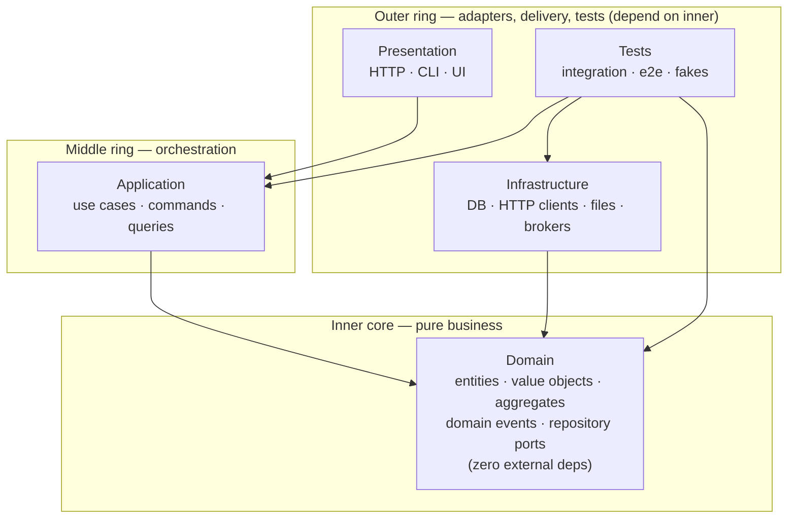

# Onion / DDD — Theory reference

> Extracted from `SKILL.md` PART 1 — the **why** behind the layering rules.
> Load this file when the SKILL.md routing block points you to "theory".
> Sister files: `audit.md` (PART 2), still inline in SKILL.md as PART 3 + 4.

# PART 1 — THEORY (the *why*)

## The One Rule (Palermo, verbatim)

> "All code can depend on layers more central, but code cannot depend on layers further out from the core. In other words, all coupling is toward the center."
> — Jeffrey Palermo, *The Onion Architecture: Part 1* (2008)

Inner layers define interfaces (contracts). Outer layers implement them. The Domain Model is coupled only to itself. If a piece of code in a deeper layer imports something from a shallower one, the design is broken.

## The Dependency Inversion Principle (the engine)

Onion Architecture is what you get when you apply Robert C. Martin's Dependency Inversion Principle (DIP) at the scale of an entire codebase. Two clauses, both relevant:

1. **"High-level modules should not import anything from low-level modules. Both should depend on abstractions (e.g., interfaces)."**
2. **"Abstractions should not depend on details. Details (concrete implementations) should depend on abstractions."**

In Onion terms: the Domain (high-level — the business) defines abstract ports. Infrastructure (low-level — the database, the HTTP client, the message broker) implements those ports. The arrow of dependency is **inverted** relative to the runtime call graph: at runtime Application calls Infrastructure (to save a record); at compile time Infrastructure depends on Domain (to know which trait to implement). The runtime flow flows outward; the source-code dependency flows inward.

### DIP is not Dependency Injection

- **DIP** is a structural rule about which side owns the abstraction (high-level owns it; low-level conforms). It describes *what the dependency graph looks like*.
- **DI** is a wiring technique for supplying a concrete implementation to a consumer at construction time. It describes *how the wiring happens*.

Onion needs DIP to be valid; DI is just one convenient way to honour it at the composition root.

### Database externalization — Palermo's sharpest claim

> "The database is not the center. It is external."

Most legacy enterprise codebases are built around the data model. Palermo's argument: that's the wrong centre. Schemas churn (every few years a new ORM, a new query language, a new vector DB). If the centre changes every three years, the system is permanently legacy. Putting the **business model** at the centre and treating the database as just another adapter behind a port is what makes Onion-architected systems survive multiple persistence rewrites without touching the domain.

## The Four Layers (inside-out)

This skill uses a four-layer simplification (Domain / Application / Infrastructure / Presentation) common in modern DDD literature. Palermo's original 2008 paper is less prescriptive about the count — he describes a Domain Model at the centre, "Application Core Layers" around it, and an outer ring that explicitly contains UI, Infrastructure, **AND Tests** as peers. The four-layer view is a useful teaching shape; the dependency rule and the dependency-inversion engine are identical to Palermo's.

Domain at the centre, Application around it, **Presentation, Infrastructure, and Tests share the outermost ring as siblings**. All depend inward; none depend on each other:



Tests sit in the outer ring because they are the *consumers* of every inner layer. Production code in any inner layer is forbidden from depending on test code.

Key consequences:

- **Infrastructure does NOT depend on Application.** Infrastructure adapters implement Domain ports directly.
- **Presentation does NOT depend on Infrastructure.** Presentation calls Application services; Application calls ports; the composition root wires the concrete Infrastructure adapter into the Application service at startup.
- **Domain depends on nothing inside the workspace.** It must compile against the language's standard library alone.

### 1. Domain Layer (the core — zero external deps)

The pure expression of the business. No framework imports. No SQL. No HTTP types. No logger. Code in this layer must compile and run against `std` alone.

| Component | What it is |
|---|---|
| **Entity** | An object with identity that persists across state changes (`User { id, name, email }`). Methods enforce invariants. |
| **Value Object** | An immutable, identity-less concept defined by its attributes (`Money { amount, currency }`, `EmailAddress`, `DateRange`). |
| **Aggregate** | A cluster of entities + value objects treated as a single transactional boundary, with one **aggregate root** as the only external entry point. |
| **Domain Service** | Stateless behavior that doesn't naturally belong on one entity (e.g. `TransferService` moves money between two `Account` aggregates). |
| **Repository Interface** | A contract for retrieving and persisting an aggregate. **Defined here. Not implemented here.** *Variance note*: Palermo's 2008 paper placed repository interfaces in an "Application Core" ring around Domain, not inside Domain itself. Modern DDD practice (Vernon, Evans-rev) places them inside Domain to express persistence in the ubiquitous language. Both valid; dependency direction is identical either way. This skill assumes the modern DDD placement. |
| **Domain Event** | An immutable record of something that happened (`OrderPlaced { order_id, at }`). Published by the domain, subscribed to by application/infrastructure. |

The domain says *what* the business does, not *how* it's stored or shown.

### 2. Application Layer (use cases / orchestration)

Implements the use cases that compose domain operations. One method per user-visible action.

| Component | What it is |
|---|---|
| **Application Service** | Coordinates a use case: load aggregates via repository interfaces, call domain methods, save back, emit events. Holds no business rules itself. |
| **Command / Query** | Input DTOs that the application service accepts. |
| **Result / View Model** | Output DTOs returned to the presentation layer. |

Application services receive repository interfaces (and any other infrastructure ports) via dependency injection. They never construct concrete infrastructure.

### 3. Infrastructure Layer (adapters)

Concrete implementations of every interface defined in Domain or Application. The "how" to Domain's "what".

| Component | What it is |
|---|---|
| **Repository Implementation** | `PostgresUserRepository implements UserRepository`. Owns the SQL, the connection pool, the schema mapping. |
| **External Service Adapter** | `StripePaymentGateway implements PaymentGateway` — wraps an outbound HTTP call behind a domain port. |
| **Anti-Corruption Layer (ACL)** | An adapter that translates between an external bounded context's model and yours, preventing external concepts from polluting the domain. |
| **Persistence Schema** | Migrations, ORM mapping, tables. Schema lives here, not in Domain. |
| **Message Broker Adapter** | Publishes domain events outbound, subscribes to inbound events. |

Infrastructure depends on Domain (to know which interfaces to implement) and uses the framework du jour. It does **not** depend on Application — application orchestrates over infrastructure ports, not concrete adapters.

### 4. Presentation Layer (delivery)

User-facing entry points. Translates external requests into Application commands and Application results into external responses.

| Component | What it is |
|---|---|
| **Controller / Route Handler** | Parses the HTTP request, calls an application service, formats the response. |
| **CLI Command** | Same shape, different transport. |
| **GraphQL Resolver / WebSocket Handler** | Same shape, different transport. |
| **Auth Middleware** | Authenticates the caller, sets the request principal. Authorization rules belong in Application or Domain, depending on whether they're business rules or use-case rules. |

Presentation knows about HTTP/CLI/etc. Application doesn't. If you find yourself calling `req.body` inside an application service, you've leaked.

## Decision rules: where does this code go?

| Question | Answer |
|---|---|
| Is it a business rule that's true regardless of how the user reaches the system? | **Domain.** |
| Is it a step in a use case ("first do A, then B, finally C")? | **Application.** |
| Is it an `INSERT INTO users` or an `await fetch(...)` call? | **Infrastructure.** |
| Is it parsing JSON from a request, returning HTTP status codes, or formatting CLI output? | **Presentation.** |
| Is it validating that an email is well-formed? | **Domain** (value object constructor). |
| Is it validating that a request has the right Bearer token? | **Presentation** (auth middleware). |
| Is it validating that the caller is allowed to perform this use case? | **Application** (authorization is part of the use case). |
| Is it validating that this user can transfer money from this account (i.e. they own it)? | **Domain** (it's an invariant of the Account aggregate). |
| Is it logging? | **Infrastructure**, accessed via a domain-defined `Logger` port. The domain doesn't know about logging libraries; it knows about `log_event(...)`. |
| Is it a DTO with no behavior, just shape? | **Application** (commands/results) or **Presentation** (request/response models). Domain types are richer than DTOs. |
| Is it a date-formatting helper? | Wherever it's used. Domain-needed → domain value object. Controller-only → presentation helper. |

## Anemic Domain Model — the single most common failure

If your entities are bags of getters/setters with all logic in services, you have an anemic domain model. The architecture *looks* layered but the domain is a hollow data container. Symptoms:

- Entities have no methods that aren't getter/setter pairs.
- Services contain `if user.status == 'active' { user.set_status('inactive') }` instead of `user.deactivate()`.
- "Validation" lives in service code, not in entity constructors / methods.

**Fix**: move invariants and state transitions onto the entity. The service becomes a thin coordinator. The domain becomes worth protecting.

## Testing strategy by layer

| Layer | Test type | What you mock | Why |
|---|---|---|---|
| Domain | Pure unit tests | Nothing | The domain has no external deps, so mocks aren't needed. Fast, deterministic. |
| Application | Unit tests | Repository / port interfaces | Verify orchestration, not the storage backend. |
| Infrastructure | Integration tests | Nothing real (use real DB / HTTP) | Mocks here would test your mocks, not the integration. |
| Presentation | Contract tests / API tests | Application services (sometimes) | Verify request → response shape. |
| Cross-layer | End-to-end | Nothing | Full happy-path through real adapters. Few of these. |

A healthy test pyramid: many domain unit tests, fewer application unit tests, a moderate number of infrastructure integration tests, a small number of e2e tests.

## When NOT to use Onion Architecture

The pattern has real cost: more interfaces, more files, more dependency injection wiring, more cognitive load. Skip it (or use a thinner version) when:

- The system is genuinely a CRUD frontend over one table — the "domain" is the table.
- The team is small and the lifespan is short (<6 months).
- The use cases are read-mostly with no invariants.
- You're prototyping. Build the simplest thing that works, then refactor toward layers when complexity demands them, not preemptively.

The pattern earns its cost when there are **business rules worth protecting from churn in frameworks, databases, and UI**.

## Scaling patterns

### Microservices: one Onion per bounded context

Each bounded context (Billing, Inventory, Identity) becomes its own service with its own four layers. Cross-context communication is via:

- **Anti-corruption layer (ACL)**: translates the other context's events/API into your domain language at the infrastructure boundary.
- **Domain events** over a message broker.
- **Shared kernel**: a small library of types shared between contexts. Owned jointly. Changed only with consensus.

### Event-driven flow

1. Application service calls `account.transfer(...)` on a domain aggregate.
2. The aggregate produces a `MoneyTransferred` domain event.
3. Application service persists the aggregate (one transaction) and emits the event (same transaction or via outbox pattern).
4. Infrastructure publishes the event to the broker.
5. Other contexts consume it through their own ACLs.

### Modular monolith — the in-between

Structure the monolith as one Onion per module with strict module boundaries enforced at the package/crate level. Each module exposes only its application services to siblings; domain and infrastructure stay private.

## Explicit Architecture extensions (Graça synthesis)

Herberto Graça's *Explicit Architecture* (2017) folds DDD + Hexagonal +
Onion + Clean + CQRS into one model. Five concepts it surfaces that
the standard 4-layer view tends to leave implicit — incorporate them
when they clarify a finding or remediation.

### Primary vs Secondary adapters

The Hexagonal half of the synthesis splits adapters by who initiates
the call:

| Kind | a.k.a. | Initiates | Wraps a port? | Examples |
|---|---|---|---|---|
| **Primary (driving)** | "Receiving" | Outside world → app core | *Wraps* / consumes a port | Controllers, CLI commands, Bus listeners, gRPC servers, MCP `tools/call` handlers |
| **Secondary (driven)** | "Sending" | App core → outside world | *Implements* a port | Repository impls, HTTP clients to external APIs, message-broker producers, file-system writers |

Audit corollary: a misplaced adapter usually fails this test. A
"repository" that lives upstream and *consumes* the app core (instead
of being injected into it) is actually a primary adapter mis-named.

> **"Ports are created to fit the Application Core needs and not simply mimic the tools APIs."** — Graça

If your port signature looks like the tool's vendor SDK with the
prefix renamed, it's a leaky port. Re-design from the consumer's call
sites inward.

### Application Core (= Application Layer + Domain Layer)

The 4-layer model treats Application and Domain as two separate
layers. Graça wraps both into "Application Core" — the territory the
business actually owns — with the outer two (Presentation +
Infrastructure) clearly outside it:

```text
                ┌────────────────────────────────────┐
                │  Presentation  │  Infrastructure   │   ← outer
                ├────────────────┴───────────────────┤
                │           Application Core         │
                │   ┌──────────────────────────┐     │
                │   │  Application Layer       │     │   use cases,
                │   │  (use cases, ports,      │     │   handlers,
                │   │   command/query handlers)│     │   ports
                │   ├──────────────────────────┤     │
                │   │  Domain Layer            │     │   entities,
                │   │  (entities, value        │     │   value
                │   │   objects, dom. svcs)    │     │   objects
                │   └──────────────────────────┘     │
                └────────────────────────────────────┘
```

Useful framing because audits often catch a Tool/Adapter sneaking *into*
the Core. "Inside vs outside the Core" is a single binary check that
folds two layer-violation findings into one.

### Application Services vs Domain Services

Both exist. Routinely confused. Boundary:

| | Application Service | Domain Service |
|---|---|---|
| Layer | Application | Domain |
| Knows about | Use case shape, repositories, ports | Entities + other Domain Services only |
| Typical body | "load aggregate via repo → call entity method → save → emit event" | Cross-entity invariant ("transfer money between two accounts") |
| Aware of UI/transport? | Yes (commands/queries shaped for it) | No |
| May call repositories? | Yes | **No** |
| May dispatch events? | Application Events | Domain Events |

Audit corollary: a Domain Service that calls a repository is a
P0 (Domain reaching outward). Promote the call to an Application
Service that loads the aggregates first, then delegates the
cross-entity logic to the Domain Service.

### CQRS placement (when CQRS is in play)

CQRS sits *inside* the Application Layer; it's not a fifth layer.

| Concept | Lives in | Notes |
|---|---|---|
| `Command` (DTO) | Application | Intent to mutate state |
| `Query` (DTO) | Application | Intent to read state |
| Command Handler | Application | Loads aggregate, calls domain method, persists, emits Domain Events |
| Query Handler | Application | Returns optimized **DTOs / view models**, not domain objects |
| Command/Query **Bus** | Wrapped by a Primary Adapter | Controller → Bus → resolves handler by config |

Two audit signals worth catching:
- **Query Handler returns a domain entity** — leaks domain shape into
  presentation; map to a DTO inside the handler.
- **Command Handler talks to multiple aggregates** — usually a missing
  Domain Service or, for cross-aggregate consistency, a missing
  saga / process manager. Don't fix by collapsing the aggregates.

### Domain Events vs Application Events + Shared Kernel

Two distinct event flavours, often conflated:

- **Domain Event** — "Something the business cares about happened in the
  Domain." (`OrderPlaced`, `MoneyTransferred`). Lives in Domain Layer;
  raised by aggregates. Subscribers may be in Application or another
  Bounded Context.
- **Application Event** — "Something the use case finished." Often the
  signal that a side effect should now run (send email, enqueue job).
  Lives in Application Layer; raised by Application Services.

For multi-component / multi-context event coordination, use a
**Shared Kernel** — a small, jointly-owned package containing:
- Cross-context Event definitions
- Specification objects shared across contexts
- Universal value objects (`CustomerId`, `Money`)

> "Should be as minimal as possible because any changes to the Shared Kernel will affect all components." — Graça

If you find yourself adding an aggregate or a service to the Shared
Kernel, stop — it should belong to *one* context with the others
talking to it through an ACL.

### Components (orthogonal to layers — package by component)

Layers cut horizontally; components cut vertically.

```text
                Layers ↓                     Components →
                                  Orders   Inventory   Identity
              Presentation        ▓▓▓▓▓    ▓▓▓▓▓       ▓▓▓▓▓
              Application         ▓▓▓▓▓    ▓▓▓▓▓       ▓▓▓▓▓
              Domain              ▓▓▓▓▓    ▓▓▓▓▓       ▓▓▓▓▓
              Infrastructure      ▓▓▓▓▓    ▓▓▓▓▓       ▓▓▓▓▓
```

Each component is a bounded context — a coherent slice of the
business — with its OWN four layers inside it. Cross-component calls
go through ACLs or domain events, NEVER direct internal imports.

Two repo organisations capture this differently:
- **Package by layer** — `src/{controllers, services, entities, repositories}/...`
  Easy to scan "all controllers"; hard to delete one component.
- **Package by component** — `src/{orders/{...4-layer...},
  inventory/{...}, identity/{...}}/`. Easy to extract a component;
  harder to compare-across-layers.

Modern guidance favours package-by-component. Audit signal: if your
project is package-by-layer and one layer's directory has 200+ files,
the boundary that's missing is *component*, not deeper layer
sub-decomposition.

## Project structure template

| Layer | Dir | Sample files |
|---|---|---|
| Domain | `orders/domain/entities/` | `Order`, `OrderLine` |
| Domain | `orders/domain/value_objects/` | `Money`, `Quantity` |
| Domain | `orders/domain/events/` | `OrderPlaced`, `OrderCancelled` |
| Domain | `orders/domain/ports/` | `OrderRepository`, `PaymentGateway` (interfaces) |
| Application | `orders/application/commands/` | `PlaceOrderCommand` |
| Application | `orders/application/services/` | `PlaceOrderService` |
| Application | `orders/application/queries/` | `GetOrderByIdQuery` |
| Infrastructure | `orders/infrastructure/persistence/` | `PostgresOrderRepository` |
| Infrastructure | `orders/infrastructure/http/` | `StripePaymentGateway` |
| Infrastructure | `orders/infrastructure/messaging/` | `KafkaOrderEventPublisher` |
| Presentation | `orders/presentation/http/` | `OrderController`, route definitions |
| Presentation | `orders/presentation/cli/` | `cli orders place` (if exposed) |

Directory names vary by language convention (`internal/` for Go, `src/main/java/.../` for Java, `crates/<module>/` for Rust workspaces) but layering and dependency direction are universal.

