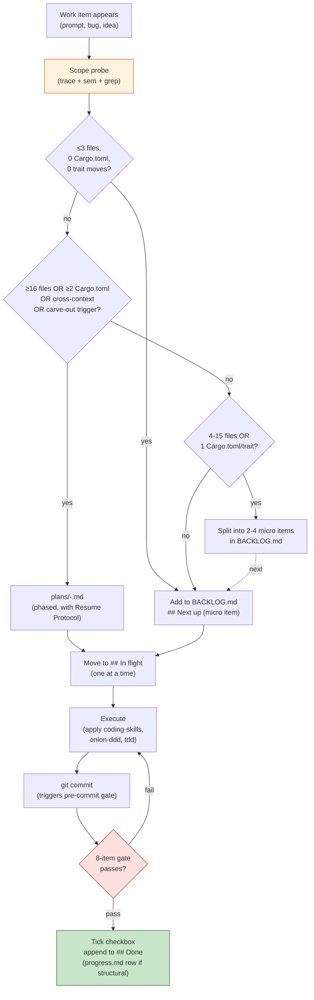

# Git Workflow — Consistent commit discipline across projects

A single skill that turns the prose rules in your CLAUDE.md (global +
project) into an enforceable, project-agnostic git workflow:

- **Sizing model** — when work stays a checkbox vs. when it earns a plan file or an architecture log row, sized by trace + sem + grep, NEVER by clock-time.
- **BACKLOG.md** — single rolling summary file replacing tiered plan-file proliferation for everything under "plan file" threshold.
- **Pre-commit gate** — one shell script enforcing the 8-item checklist (cargo/tsc/etc clean, structural→progress.md row, plan→checkbox tick, `git rm`→belief scan, Conventional Commits prefix, no-sha-in-CLAUDE.md, paired-test for new code, project-specific verify).
- **Skill weaving** — the gate references coding-skills, onion-ddd-workflow, superpowers:*, tdd, memory/Remember; the SKILL knows when to suggest invoking which.

## ⚠ Read-in-full discipline (Iron Law)

This skill body MUST be read end-to-end before applying any section.
The sizing rule, the 8-item checklist, and the skill-weaving table
only hold together. Skipping any one section turns the workflow into
selective enforcement — exactly the inconsistency this skill exists
to eliminate.

## Bundled skills (session + project agnostic — 34 total)

This plugin **bundles every skill the gate routes to or coexists with** so it works without dependencies on other plugins. Once installed, all 34 are auto-discovered under the `kaizen:` namespace.

### TDD + coding principles (11)

| Bundled skill | Purpose |
|---|---|
| `kaizen:tdd` | Operational TDD runbook (tiering + EDD + phase pipeline) |
| `kaizen:detect-stack` | Stack detection feeding the 8 principle skills |
| `kaizen:kiss` | Simplify complexity |
| `kaizen:yagni` | Prevent over-engineering |
| `kaizen:solid` | Module boundaries / DI / interface design |
| `kaizen:dry` | Duplicated knowledge |
| `kaizen:separation-of-concerns` | Layer + module boundaries |
| `kaizen:law-of-demeter` | Coupling / object-chain depth |
| `kaizen:boy-scout-rule` | Leave touched code better |
| `kaizen:convention-over-configuration` | Project structure / patterns |
| `kaizen:onion-ddd-workflow` | Onion/DDD theory + audit + plan/execute |

### Superpowers (14)

| Bundled skill | Purpose |
|---|---|
| `kaizen:using-superpowers` | Foundational — when/how to use skills |
| `kaizen:brainstorming` | Pre-implementation discovery |
| `kaizen:writing-plans` | Multi-step plan authoring |
| `kaizen:executing-plans` | Plan execution with review checkpoints |
| `kaizen:subagent-driven-development` | Plan execution with subagents |
| `kaizen:dispatching-parallel-agents` | Parallel independent tasks |
| `kaizen:test-driven-development` | Foundational TDD discipline (paired with bundled `tdd`) |
| `kaizen:systematic-debugging` | Debug discipline before fix |
| `kaizen:verification-before-completion` | Evidence before assertions |
| `kaizen:requesting-code-review` | Self-review checklist |
| `kaizen:receiving-code-review` | Handle review feedback rigorously |
| `kaizen:finishing-a-development-branch` | End-of-branch flow |
| `kaizen:using-git-worktrees` | Isolated workspace flow |
| `kaizen:writing-skills` | Skill authoring |

The gate references these by short name. Claude Code resolves them via the plugin namespace.

### Workflow-routing (1)

| Bundled skill | Purpose |
|---|---|
| `kaizen:workflow-routing` | Multi-stage routine engine (`/workflow` command). Owns `.workflow/state.json` + `.workflow/snapshot.md` via its `scripts/workflow.sh`. Gate reads `state.json` for active-routine hints. |

### Remember / Second Brain (5)

| Bundled skill | Purpose |
|---|---|
| `kaizen:remember` | Capture knowledge — "remember this", "save this", "brain dump" |
| `kaizen:process` | Process unprocessed Claude Code sessions into the Second Brain |
| `kaizen:evolve` | Weekly LLM-driven consolidation/reflection |
| `kaizen:status` | Brain stats |
| `kaizen:init` | Initialize Second Brain structure |

Remember's supporting scripts (`build-index.js`, `extract.js`, `schema.js`, `promote.js`, `append-evidence.js`, `evolution-log.js`, `session_start.js`, `user_prompt.js`, `config.js`, `build-context.js`) ship under the plugin root at `${CLAUDE_PLUGIN_ROOT}/scripts/`. References at `${CLAUDE_PLUGIN_ROOT}/references/`. Templates at `${CLAUDE_PLUGIN_ROOT}/assets/templates/`. Default config at `${CLAUDE_PLUGIN_ROOT}/config.defaults.json`. User-customisable config template at `REMEMBER.md.template` (copy to brain root + tailor).

Hooks (merged into this plugin's `hooks/hooks.json`):
- **SessionStart** — runs `session-surface-backlog.sh` (this plugin) AND `session_start.js` (remember). Both inject `additionalContext`.
- **UserPromptSubmit** — runs `user_prompt.js` (remember) for capture-keyword detection.

## All bundled, no peer skills required

The plugin is fully self-contained. The `workflow-routing` and `remember` plugins are NOT prerequisites — their content is inside this plugin. Installing them separately is OK (skills appear under both namespaces), but redundant.

## End-to-end picture



# PART 1 — Sizing (trace + sem + grep, not hours)

NEVER use clock-time to size work. Use measurable blast radius:

| Probe | Command (language-agnostic shape) |
|---|---|
| File-hit count | `grep -rE "<symbol\|concept>" --include='*.<lang>' \| wc -l` |
| Reverse-dep count | `cargo tree -i -p <crate>` / `go list -deps` / `npm list <pkg>` |
| Caller+callee graph | `ast-grep` / `llm-tldr-deep` / language LSP "references" |
| Cross-context hops | Count crates / packages / modules touched |
| Structural-manifest edits | Cargo.toml / package.json / go.mod / pyproject.toml changes |
| Trait/interface moves | Port lifts between layers (Onion signal) |
| Canonical-source convergence | `git grep -l` across reference dirs (e.g. `port/<canon>`) |

## Thresholds

| Probe result | Action | Lives in |
|---|---|---|
| ≤3 files, 0 Cargo.toml, 0 trait moves, single bounded context | stays MICRO, single checkbox | `BACKLOG.md ## In flight \| Next up` |
| 4–15 files OR 1 Cargo.toml OR 1 trait move | split into 2–4 sibling micros | `BACKLOG.md ## Next up` |
| ≥16 files OR ≥2 Cargo.toml OR cross-context OR carve-out triggered (per project's dynamic-LOC rule) | promote to plan file | `plans/<date>-<slug>.md` |
| Probe fails to converge | park with failing probe noted | `BACKLOG.md ## Parked / deferred` |

The **escalation trigger is measurable**, not gut-feel about hours. See `Notes/pref-sizing-by-trace-not-hours.md` in your brain.

# PART 2 — Backlog (JSON-sourced, `.md` is generated)

The rolling summary replacing the proliferation of `plans/<date>-<x>.md` for everything under the plan-file threshold. **Two files, one source:**

- `backlog.json` — **source of truth**. Schema `kaizen.backlog` v1. Edited via `scripts/backlog.py` subcommands (never by hand).
- `backlog.md` — **generated view**. Human-readable. Regenerated on every mutation. CI gate (`backlog.py verify`) blocks if drifted from `.json`.

This mirrors the TODO.json → TODO.md pattern: JSON enables schema-validated programmatic ops (add / start / tick / park / decision) plus reliable diffs; markdown stays the human-readable interface.

## Schema (`kaizen.backlog` v1)

```json
{
  "schema_version": 1,
  "kind": "kaizen.backlog",
  "metadata": {
    "created": "YYYY-MM-DD",
    "updated": "YYYY-MM-DD",
    "active_workflow_ref": null
  },
  "items": [
    {
      "id": "BK-001",
      "section": "in_flight | next_up | done | parked",
      "title": "verb-first description",
      "ref": "optional source citation (e.g. handoff §lim 4)",
      "probe": "grep/trace/sem command proving the item stays micro",
      "verify": "command proving the work is done",
      "tags": ["observability", "lsp"],
      "created": "YYYY-MM-DD",
      "started_at": "ISO-8601 UTC | null",
      "committed": "short-sha | null",
      "committed_at": "ISO-8601 UTC | null",
      "parked_reason": "string | null",
      "probe_output": "captured probe result | null"
    }
  ],
  "decisions": [
    { "date": "YYYY-MM-DD", "text": "one-liner", "why": "rationale" }
  ]
}
```

Schema-envelope is intentionally compatible with the `workflow-routing` skill's `state.json` family (`metadata` with `created`/`updated`/cross-ref; `items` array with stable ids) so a future `wf-stage`-aware command could link backlog items to workflow stages via `metadata.active_workflow_ref`.

## CLI (`scripts/backlog.py`)

| Command | Effect |
|---|---|
| `backlog list [section]` | List items (sections: `in_flight` / `next_up` / `done` / `parked` / `all`) |
| `backlog show <id>` | Print one item as JSON |
| `backlog add --title T --probe P --verify V [--section S --ref R --tags A,B]` | Append a new item (default section `next_up`) |
| `backlog start <id>` | Move `next_up` → `in_flight` (timestamps `started_at`) |
| `backlog tick <id> [--committed SHA]` | Move `in_flight` → `done` (timestamps `committed_at`) |
| `backlog park <id> --reason R` | Move to `parked` |
| `backlog unpark <id> [--section S]` | Move out of `parked` (default `next_up`) |
| `backlog decision --text T [--why Y]` | Append a one-liner to `## Decisions` |
| `backlog render` | Regenerate the `.md` view |
| `backlog verify` | Exit non-zero if `.md` drifted from `.json` (CI gate) |

Every mutating command auto-renders the `.md` view, so it never drifts in normal use. The gate's `verify` subcommand catches manual edits to the generated `.md` (treat them as a corruption signal — re-render).

## Location

`backlog_path` in `.kaizen.toml` points at the `.md` view; `.json` source sits alongside (`<stem>.json`). Defaults:

| Project shape | Recommended `backlog_path` |
|---|---|
| Has `.workflow/` (state.json, progress.md, audits) | `.workflow/backlog.md` |
| Has `docs/workflow/` or `docs/state/` | `docs/workflow/backlog.md` |
| Greenfield / no state dir | `backlog.md` (repo root) |

Lowercase fits the `.workflow/` convention (`state.json`, `snapshot.md`, `progress.md`).

## `.workflow/` namespace ownership

When `backlog_path = ".workflow/backlog.md"`, the directory is shared with the `workflow-routing` skill (the `/workflow` command). Ownership is namespaced by filename — no cross-write, no conflict:

| File | Owner | Writer | Reader |
|---|---|---|---|
| `.workflow/state.json` | **`workflow-routing` skill** | `scripts/workflow.sh` only | kaizen gate reads (active-routine hint) |
| `.workflow/snapshot.md` | **`workflow-routing` skill** | PreCompact hook | PostCompact hook |
| `.workflow/backlog.json` | **`kaizen` skill** (this one) | `scripts/backlog.py` only | gate, agent, humans |
| `.workflow/backlog.md` | **`kaizen` skill** | `scripts/backlog.py render` (auto on every mutation) | humans, agent on session start |
| `.workflow/progress.md` | **project convention** (architecture log) | agent (same commit as structural change) | gate (Check #3), humans |
| `.workflow/decisions.md`, audit reports, `migration-loop-state.md`, `REPORT.md`, etc. | **project convention** | agent (per project CLAUDE.md) | humans, agent on session start |

Rules:
- The kaizen skill NEVER writes `state.json` or `snapshot.md`.
- The workflow-routing skill NEVER writes `backlog.json` / `backlog.md`.
- `backlog.md` is REGENERATED, never hand-edited. The gate's `backlog.py verify` catches drift.
- Project-convention files (`progress.md`, audits) are managed per the project's own CLAUDE.md.

Both skills share the JSON envelope convention (`schema_version`, `metadata.created`/`updated`), so future tooling can join their state without per-skill parsers.

If a project doesn't use the workflow-routing skill at all, `.workflow/` is just a project state dir; no conflict possible.

## Sections (canonical order)

```markdown
# Backlog

> Single rolling summary. Tier-up to plans/<date>-<slug>.md only when
> blast radius forces it. See ~/.claude/skills/kaizen.

## In flight
- [ ] <one item, currently being worked> — probe: <cmd> — verify: <cmd>

## Next up
- [ ] <item 1> — probe: <cmd> — verify: <cmd>
- [ ] <item 2> — probe: <cmd> — verify: <cmd>

## Done (this week)
- [x] <item> — committed: <sha-short> — <date>

## Parked / deferred
- [ ] <item> — parked: <reason> — probe-output: <evidence>

## Decisions
- <date> | <one-line architectural decision> | <why>
```

## Item template (every item, every section)

```
- [ ] <verb-first description> — probe: <grep/trace/sem cmd> — verify: <cmd>
```

- **Verb-first**: "Wire find_references via LSP adapter", not "find_references work"
- **Probe field**: the trace/sem/grep command that proves the item stays micro. If absent, the item should not enter `## In flight`.
- **Verify field**: the command that proves the work is done. Hook checks this ran green.

## Lifecycle

1. **Enter**: appears in `## Next up`, with probe field filled in.
2. **Pickup**: move to `## In flight`, re-run probe to confirm size.
3. **Commit**: tick the checkbox in the same commit as the implementation.
4. **Roll-off**: move to `## Done (this week)` with short sha; archive weekly to `plans/archive/YYYY-MM/backlog-YYYY-WW.md` (or just drop, if the architecture log captured the structural rows).
5. **Park / abandon**: move to `## Parked / deferred` with reason + probe output explaining why it can't proceed.

## Why ONE file

- Cross-session continuity: session B reads `## In flight` + `## Next up` and picks up.
- One place to scan at session start: ≤300 LOC, full read is cheap.
- Forces granularity: a multi-day task decomposes into bullets, not a 1000-line plan.
- Architecture decisions live inline in `## Decisions` as one-liner mini-ADRs.

When NOT to use BACKLOG.md — use a plan file instead when:
- ≥3 phases with explicit dependency ordering
- Carve-out triggered (per project's dynamic-LOC rule)
- Risk register / rollback ordering needed
- Cross-context migration

# PART 3 — The 10-check pre-commit gate

These are the rules the pre-commit hook enforces. Each maps to a check function in `scripts/pre-commit.sh`. The hook BLOCKS on hard-fail, WARNS on soft-fail.

| # | Check | Hard / Soft | When it fires |
|---|---|---|---|
| 1 | **Compile barrier passes** | HARD | Always. Resolved via `.kaizen.toml` (`compile_check_cmd`) or built-in heuristics (Rust→`cargo check --workspace`, TS→`npx tsc --noEmit`, Go→`go build ./...`, Python→`ruff check`/`mypy`). |
| 2 | **Conventional Commits prefix** | HARD | Commit message must start with `^(feat\|fix\|refactor\|docs\|chore\|test\|perf\|build\|ci\|style\|revert)(\([^)]+\))?:` (optional scope). |
| 3 | **Structural change → progress.md row** | HARD | Staged diff is "structural" (see classifier below) AND `.workflow/progress.md` (or configured architecture-log path) is NOT in the staged diff → BLOCK. |
| 4 | **Plan-file mention → checkbox tick** | HARD | Commit message names a `plans/*.md` file AND staged diff doesn't include a `- [x]` flip in that file → BLOCK. |
| 5 | **`git rm` / destructive `git mv` → pre-deletion gate** | HARD | Staged diff contains deletions → scan Persona `## Top Beliefs` + project memory for deletion-prevention rules (e.g. `pref-no-deletions`, `feedback_borg_loop_no_deletions`). If a matching rule exists → BLOCK unless `KAIZEN_ALLOW_DELETE=1` is set (explicit user override). |
| 6 | **No sha / date / LOC count in CLAUDE.md** | HARD | Staged CLAUDE.md diff contains a commit-sha pattern (`[0-9a-f]{7,40}`), an ISO date inside a rule sentence, or "X passed / Y LOC" snapshots → BLOCK. CLAUDE.md is the rulebook, not a changelog. |
| 7 | **New code → paired test exists** | SOFT (WARN) | New non-test source file added AND no corresponding test file / `#[cfg(test)] mod tests` / equivalent → WARN. Override via `KAIZEN_SKIP_TDD_CHECK=1`. |
| 8 | **Project-specific verify** | HARD or SOFT (project choice) | Runs `verify_cmd` from `.kaizen.toml` if present. E.g. for shodan: `shodan-todo verify` to catch TODO.md drift. |
| 9 | **Committed-secret detection** | HARD | High-confidence regex scan over staged diff for AWS keys (`(AKIA\|ASIA)…`), GitHub tokens (`gh[oprsu]_…`), OpenAI `sk-…`, Slack `xox[abprs]-…`, Google API keys (`AIza…`), JWTs, and `-----BEGIN…PRIVATE KEY-----` blocks. Bypass for fixtures: `KAIZEN_ALLOW_SECRET=1`. |
| 10 | **Backlog `.md` drift vs `.json`** | HARD | Runs `backlog.py verify` to ensure `<workflow_dir>/backlog.md` matches `<workflow_dir>/backlog.json`. Catches hand-edits of the generated `.md` view. Fix: `python3 backlog.py render`. |

## Structural change classifier

A diff is "structural" iff ANY of:

- Any `Cargo.toml` / `package.json` / `go.mod` / `pyproject.toml` / `Gemfile` change OTHER than a pure version bump in `[dependencies]` (use git-diff-numstat heuristic + content scan)
- Any new `Cargo.toml` / new `package.json` in a directory not previously a workspace member (new crate / new package)
- Any `src/lib.rs` / `src/index.{ts,js}` / `__init__.py` change adding/removing `pub mod` / `pub use` / `export` / `__all__`
- File moved across directory boundaries that match the project's crate/package roots (`crates/*/src/`, `packages/*/src/`, etc.)
- `impl <Trait> for <X>` block moved between files (Onion port lift signal)
- Project-defined extras from `.kaizen.toml` `structural_patterns`

A diff is NOT structural when:
- Only test files (`tests/`, `*_test.go`, `*.test.ts`) changed
- Only `Cargo.lock` / `package-lock.json` / `go.sum` changed (no manifest)
- Only docs (`*.md` outside `plans/` and `CLAUDE.md`)
- Only formatting / whitespace
- Only comments

# PART 4 — Hook integration

## Install

The hook lives in this skill's `scripts/pre-commit.sh`. To activate it in a project:

```bash
bash ~/.claude/skills/kaizen/scripts/install.sh
```

The installer:
1. Creates `.kaizen/hooks/` in the project
2. Symlinks `pre-commit` → the skill's `scripts/pre-commit.sh`
3. Sets `git config core.hooksPath .kaizen/hooks` LOCALLY (not global)
4. Writes a starter `.kaizen.toml` if absent
5. Adds `.kaizen/` to `.gitignore` if the project ignores tooling

Uninstall: `git config --unset core.hooksPath` (and delete `.kaizen/`).

## Config (`.kaizen.toml`)

```toml
# Optional. Defaults shown.
[project]
compile_check_cmd = "cargo check --workspace"
architecture_log = ".workflow/progress.md"
backlog_path = ".workflow/backlog.md"   # or "BACKLOG.md" at repo root
plan_dir = "plans"
canonical_source_dirs = []  # e.g. ["port/shodan3"] for convergence-check
verify_cmd = ""              # e.g. "shodan-todo verify"

[gate]
allow_deletion_env = "KAIZEN_ALLOW_DELETE"
skip_tdd_check_env = "KAIZEN_SKIP_TDD_CHECK"

[classifier]
# Extra paths that count as structural beyond defaults
structural_patterns = []
# Paths to skip entirely (e.g. generated files)
skip_patterns = ["TODO.md"]

[memory]
brain_path = "~/.claude/brain"
project_memory_path = "~/.claude/projects/<slug>/memory"
deletion_belief_files = ["Notes/pref-no-deletions.md"]
```

## Bypass

Truly emergency commits: `git commit --no-verify`. The hook is a gate, not a wall. But:

- Routine `--no-verify` is a smell. If you're skipping the gate often, the gate is wrong for the project; fix the config, don't disable.
- The global persona directive remains: NEVER skip hooks (`--no-verify`) unless the user explicitly asks for it. As an agent, you must surface the failing check and propose a fix, not bypass.

# PART 5 — Skill weaving

The gate doesn't replace existing skills; it **routes to them** when their domain is touched. Concrete weave-points:

| Gate signal | Skill the gate suggests | Why |
|---|---|---|
| Cargo.toml / package.json dep added or removed | `onion-ddd-workflow` | Dep direction may have inverted; new boundary needs a structural-lint rule |
| New trait or interface in domain layer | `onion-ddd-workflow` | Port placement check + author the port-uniqueness lint in the same commit |
| New `.rs` / `.ts` / `.py` source file with no paired test | `tdd` / `superpowers:test-driven-development` | RED first; new port → contract test; new adapter → impl-against-port test |
| Diff > 50 LOC in a single file | `coding-skills:kiss` + `coding-skills:separation-of-concerns` | Likely a refactor opportunity; check function size + responsibility |
| New abstraction (trait + 1 impl) | `coding-skills:yagni` | Premature port — wait for ≥2 consumers |
| Two parallel trait defs across crates | `coding-skills:dry` | Port duplication — the highest-leverage Onion finding |
| Plan-file mention in commit message | `superpowers:executing-plans` | Plan execution discipline — verify checkbox tick, surface deviations |
| `git rm` detected | Memory / Remember plugin | Pre-deletion gate scans `Persona.md ## Top Beliefs` for deletion-prevention rules |
| Architectural-log row added | `coding-skills:convention-over-configuration` | Match the existing row format; don't invent a new schema |
| Branch ready to merge | `superpowers:finishing-a-development-branch` | Structured completion / merge / cleanup |

The gate prints these as REMINDERS, not blocks. The agent invokes the skill before re-running the commit.

# PART 6 — Memory hooks integration

The Remember plugin's two-tier memory (brain + project) hooks into the gate in three places:

## 1. Pre-deletion gate (Check #5)

Before allowing `git rm` or destructive `git mv`, the gate scans:

- `<brain>/Persona.md ## Top Beliefs` — global beliefs with "deletion" tags
- `<brain>/Notes/pref-no-deletions.md` (canonical) — if present
- `<project-memory>/feedback_*deletion*.md` / `feedback_*no_delete*.md`

Any hit → BLOCK + print the matching rule's `## How to apply` section. Override via `KAIZEN_ALLOW_DELETE=1` if user explicitly authorized.

## 2. Commit-message memory citation (optional inject)

When a staged diff touches files matching a Top Belief's scope, the gate offers to inject `(applies Notes/<belief>.md)` into the commit message. Opt-in via `[memory] citation_inject = true` in config. Default off (existing recent commits don't use it).

## 3. Post-commit reflection trigger

After a successful commit that landed an architectural-shape change (new crate, retired module, locked rule), the gate writes a note to `<project-memory>/` flagging the decision for the next `/remember:process` run to potentially promote to a world-fact note.

# PART 7 — Common rationalizations (red flags)

| Thought | Reality |
|---|---|
| "This commit is too small to gate" | Then it passes the gate in 200ms. No cost. |
| "`cargo check` already passed, skip the rest" | Compile-clean ≠ architectural-clean. Check #3 (structural→progress.md) catches what the compiler can't see. |
| "I'll add the progress.md row in a follow-up commit" | NO. Same-commit discipline is the whole point. Per CLAUDE.md: "the doc-only follow-up is the correction shape, not the workflow shape." |
| "The plan-file checkbox is a doc detail" | It's the durable record of which phase landed when. Tick or don't claim the phase. |
| "This `git rm` is obvious cleanup" | Then the pre-deletion gate finds no matching rule and lets it through. If it blocks, the rule exists for a reason. |
| "The hook is slow, let me `--no-verify`" | Profile first. If `cargo check` is slow on incremental, the hook should use `cargo check --workspace --offline` or per-package check. Don't bypass; tune. |

# References (on-demand)

- `references/integration.md` — full skill-weaving matrix with concrete invocation examples
- `references/backlog-template.md` — canonical BACKLOG.md template with worked-example items
- `scripts/pre-commit.sh` — the hook source
- `scripts/install.sh` — per-project installer

# Iron Laws

1. **Sizing by probe, never by hours.** trace + sem + grep produces objective scope; hours produce gut-feel that lies.
2. **One file for micro work.** BACKLOG.md is the single rolling source. Plan files are reserved for ≥3 phases or carve-out triggers.
3. **Same-commit discipline.** Structural change + progress.md row in ONE commit. Plan phase + checkbox tick in ONE commit. No two-commit dance.
4. **Pre-deletion gate is non-negotiable.** Memory matches → BLOCK until explicit user override.
5. **Read this skill in full every time.** No "I remember this skill" shortcut.
