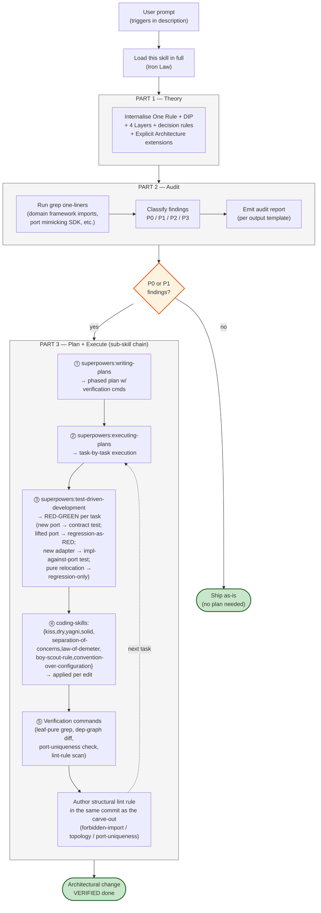
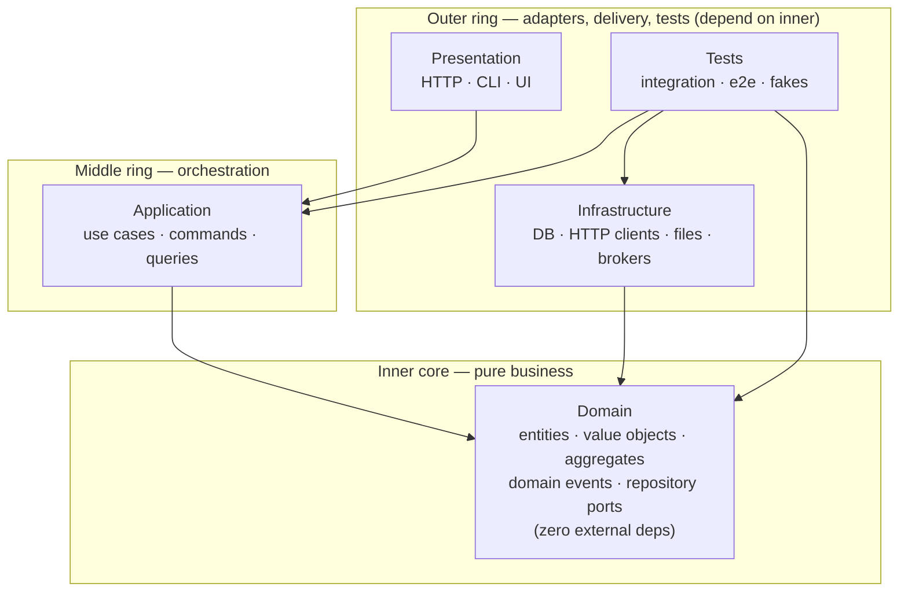
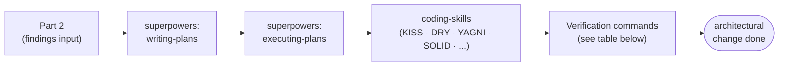

# Onion / DDD — Workflow (Theory → Audit → Plan → Execute)

Single end-to-end skill for designing, auditing, and remediating layered
codebases where the **domain model is the core** and every other layer
exists to support it. Replaces the three-skill chain (`onion-ddd-theory`,
`onion-ddd-audit`, `onion-ddd-plan`) with one cohesive document.

## Required skills (load before applying this one)

This skill *uses* but does not *contain* the following — load each via
the `Skill` tool when you reach the matching section:

- **`coding-skills`** (the bundle: `coding-skills:kiss`, `:dry`, `:yagni`,
  `:solid`, `:separation-of-concerns`, `:law-of-demeter`,
  `:boy-scout-rule`, `:convention-over-configuration`).
  Required during every code edit produced by the plan/execute step.
  The four most load-bearing for layer-boundary work: SOLID (DIP is
  *the* Onion rule), YAGNI (don't introduce ports for hypothetical
  consumers), DRY (port duplication is the highest-leverage finding
  type — grep for parallel trait defs first), Boy-Scout (fix small
  layering smells next to symbols you're already touching).
- **`superpowers:writing-plans`** — turn the audit's findings into a
  phased plan with explicit file targets, code, and verification
  commands. Required before any code edits.
- **`superpowers:executing-plans`** (or `superpowers:subagent-driven-development`
  if subagents are available) — drives the plan task-by-task with
  verification at each step. Required for the execute step.
- **`superpowers:test-driven-development`** — the discipline. Or
  `tdd` / `tdd-implementing` for the full operational runbook
  (tiering / EDD / phase pipeline). Required during each task in the
  execute step. Onion remediation is a code-relocation operation that
  introduces architectural surface needing test coverage: new ports
  → contract tests, new adapters → impl-against-port tests, lifted
  ports → regression-as-RED on the existing suite, pure relocations
  → regression-as-RED only (no new test). See Part 3 step 3 for the
  per-finding-type breakdown.
- **`verify-before-application`** — the RED-GREEN gate that wraps
  every architectural change in Part 3. Part 3 step ⓹ ("Verification
  commands") is the architectural-specific instantiation of this
  skill's GREEN matrix; the skill provides the general discipline
  (RED before apply, GREEN after, demote-with-named-failing-check on
  any gate failure) plus the integration rules across other flows.

Keep these on hand; they are referenced by section name below.

## End-to-end workflow trace

The full pipeline this skill drives, from a triggering prompt to a
verified architectural change:



**Inputs / outputs at each stage:**

| Stage | Consumes | Produces |
|---|---|---|
| PART 1 (Theory) | none — read in full | mental model: layers, deps, ports, adapters, Application Core, primary/secondary, components |
| PART 2 (Audit) | code under review | findings list (file:line + severity + fix-shape) |
| PART 3 step ⓵ (`writing-plans`) | findings list | phased plan file with explicit file targets + verification cmds |
| PART 3 step ⓶ (`executing-plans`) | plan file | tasks executed one-at-a-time; deviations flagged |
| PART 3 step ⓷ (TDD) | port/adapter/relocation shape | RED → GREEN per task; regression suite stays green |
| PART 3 step ⓸ (`coding-skills`) | code edit-in-progress | edit improved per principle (DRY for parallel ports, YAGNI for premature abstractions, etc.) |
| PART 3 step ⓹ (verification) | claim ("Domain is leaf-pure", etc.) | passing grep / dep-graph / lint scan — or RED state to fix |
| Lint rule authored | locked boundary | `rules/lints/onion-*.yml` committed alongside the carve-out |

**Where the workflow can short-circuit:**

- After PART 2 if all findings are P3 cosmetic only → ship the audit, skip PART 3.
- After PART 2 if the change is purely additive + < 10 LOC → can skip the formal plan file but **must still** run PART 3 step ⓹ (verification) before claiming done.
- Mid-PART-3 if `executing-plans` flags a deviation that contradicts a Theory invariant → loop back to PART 1 to re-ground, then re-plan.

## ⚠ Read-in-full discipline (Iron Law)

**This skill body MUST be read end-to-end before applying any section.**
Theory grounds the audit; the audit produces inputs for the plan; the
plan/execute discipline catches the failure modes ad-hoc edits hit.
Skipping any section turns the workflow into a partial application of a
discipline that was authored as a whole.

Specifically:

- Don't skim to "Decision rules" without reading "The One Rule" + "DIP".
  The decision table is meaningless without the dependency-direction
  invariant it implements.
- Don't skim to the "Audit lens" tables without reading the "Four
  Layers" section first — audit findings are descriptions of layer
  violations and cannot be diagnosed without knowing what the layers
  contract for.
- Don't skim to "Why each step is required" without reading the chain
  diagram. The argument is *why ad-hoc edits fail*, not a footnote.
- Don't lift any one section's table out of context. The sections only
  hold *together*.

If the file is too long, that's a signal you need the workflow more,
not less. **No exceptions.** No "I already know this skill" shortcut —
skills evolve; re-read every time.

# PART 1 — THEORY (the *why*)

## The One Rule (Palermo, verbatim)

> "All code can depend on layers more central, but code cannot depend on layers further out from the core. In other words, all coupling is toward the center."
> — Jeffrey Palermo, *The Onion Architecture: Part 1* (2008)

Inner layers define interfaces (contracts). Outer layers implement them. The Domain Model is coupled only to itself. If a piece of code in a deeper layer imports something from a shallower one, the design is broken.

## The Dependency Inversion Principle (the engine)

Onion Architecture is what you get when you apply Robert C. Martin's Dependency Inversion Principle (DIP) at the scale of an entire codebase. Two clauses, both relevant:

1. **"High-level modules should not import anything from low-level modules. Both should depend on abstractions (e.g., interfaces)."**
2. **"Abstractions should not depend on details. Details (concrete implementations) should depend on abstractions."**

In Onion terms: the Domain (high-level — the business) defines abstract ports. Infrastructure (low-level — the database, the HTTP client, the message broker) implements those ports. The arrow of dependency is **inverted** relative to the runtime call graph: at runtime Application calls Infrastructure (to save a record); at compile time Infrastructure depends on Domain (to know which trait to implement). The runtime flow flows outward; the source-code dependency flows inward.

### DIP is not Dependency Injection

- **DIP** is a structural rule about which side owns the abstraction (high-level owns it; low-level conforms). It describes *what the dependency graph looks like*.
- **DI** is a wiring technique for supplying a concrete implementation to a consumer at construction time. It describes *how the wiring happens*.

Onion needs DIP to be valid; DI is just one convenient way to honour it at the composition root.

### Database externalization — Palermo's sharpest claim

> "The database is not the center. It is external."

Most legacy enterprise codebases are built around the data model. Palermo's argument: that's the wrong centre. Schemas churn (every few years a new ORM, a new query language, a new vector DB). If the centre changes every three years, the system is permanently legacy. Putting the **business model** at the centre and treating the database as just another adapter behind a port is what makes Onion-architected systems survive multiple persistence rewrites without touching the domain.

## The Four Layers (inside-out)

This skill uses a four-layer simplification (Domain / Application / Infrastructure / Presentation) common in modern DDD literature. Palermo's original 2008 paper is less prescriptive about the count — he describes a Domain Model at the centre, "Application Core Layers" around it, and an outer ring that explicitly contains UI, Infrastructure, **AND Tests** as peers. The four-layer view is a useful teaching shape; the dependency rule and the dependency-inversion engine are identical to Palermo's.

Domain at the centre, Application around it, **Presentation, Infrastructure, and Tests share the outermost ring as siblings**. All depend inward; none depend on each other:



Tests sit in the outer ring because they are the *consumers* of every inner layer. Production code in any inner layer is forbidden from depending on test code.

Key consequences:

- **Infrastructure does NOT depend on Application.** Infrastructure adapters implement Domain ports directly.
- **Presentation does NOT depend on Infrastructure.** Presentation calls Application services; Application calls ports; the composition root wires the concrete Infrastructure adapter into the Application service at startup.
- **Domain depends on nothing inside the workspace.** It must compile against the language's standard library alone.

### 1. Domain Layer (the core — zero external deps)

The pure expression of the business. No framework imports. No SQL. No HTTP types. No logger. Code in this layer must compile and run against `std` alone.

| Component | What it is |
|---|---|
| **Entity** | An object with identity that persists across state changes (`User { id, name, email }`). Methods enforce invariants. |
| **Value Object** | An immutable, identity-less concept defined by its attributes (`Money { amount, currency }`, `EmailAddress`, `DateRange`). |
| **Aggregate** | A cluster of entities + value objects treated as a single transactional boundary, with one **aggregate root** as the only external entry point. |
| **Domain Service** | Stateless behavior that doesn't naturally belong on one entity (e.g. `TransferService` moves money between two `Account` aggregates). |
| **Repository Interface** | A contract for retrieving and persisting an aggregate. **Defined here. Not implemented here.** *Variance note*: Palermo's 2008 paper placed repository interfaces in an "Application Core" ring around Domain, not inside Domain itself. Modern DDD practice (Vernon, Evans-rev) places them inside Domain to express persistence in the ubiquitous language. Both valid; dependency direction is identical either way. This skill assumes the modern DDD placement. |
| **Domain Event** | An immutable record of something that happened (`OrderPlaced { order_id, at }`). Published by the domain, subscribed to by application/infrastructure. |

The domain says *what* the business does, not *how* it's stored or shown.

### 2. Application Layer (use cases / orchestration)

Implements the use cases that compose domain operations. One method per user-visible action.

| Component | What it is |
|---|---|
| **Application Service** | Coordinates a use case: load aggregates via repository interfaces, call domain methods, save back, emit events. Holds no business rules itself. |
| **Command / Query** | Input DTOs that the application service accepts. |
| **Result / View Model** | Output DTOs returned to the presentation layer. |

Application services receive repository interfaces (and any other infrastructure ports) via dependency injection. They never construct concrete infrastructure.

### 3. Infrastructure Layer (adapters)

Concrete implementations of every interface defined in Domain or Application. The "how" to Domain's "what".

| Component | What it is |
|---|---|
| **Repository Implementation** | `PostgresUserRepository implements UserRepository`. Owns the SQL, the connection pool, the schema mapping. |
| **External Service Adapter** | `StripePaymentGateway implements PaymentGateway` — wraps an outbound HTTP call behind a domain port. |
| **Anti-Corruption Layer (ACL)** | An adapter that translates between an external bounded context's model and yours, preventing external concepts from polluting the domain. |
| **Persistence Schema** | Migrations, ORM mapping, tables. Schema lives here, not in Domain. |
| **Message Broker Adapter** | Publishes domain events outbound, subscribes to inbound events. |

Infrastructure depends on Domain (to know which interfaces to implement) and uses the framework du jour. It does **not** depend on Application — application orchestrates over infrastructure ports, not concrete adapters.

### 4. Presentation Layer (delivery)

User-facing entry points. Translates external requests into Application commands and Application results into external responses.

| Component | What it is |
|---|---|
| **Controller / Route Handler** | Parses the HTTP request, calls an application service, formats the response. |
| **CLI Command** | Same shape, different transport. |
| **GraphQL Resolver / WebSocket Handler** | Same shape, different transport. |
| **Auth Middleware** | Authenticates the caller, sets the request principal. Authorization rules belong in Application or Domain, depending on whether they're business rules or use-case rules. |

Presentation knows about HTTP/CLI/etc. Application doesn't. If you find yourself calling `req.body` inside an application service, you've leaked.

## Decision rules: where does this code go?

| Question | Answer |
|---|---|
| Is it a business rule that's true regardless of how the user reaches the system? | **Domain.** |
| Is it a step in a use case ("first do A, then B, finally C")? | **Application.** |
| Is it an `INSERT INTO users` or an `await fetch(...)` call? | **Infrastructure.** |
| Is it parsing JSON from a request, returning HTTP status codes, or formatting CLI output? | **Presentation.** |
| Is it validating that an email is well-formed? | **Domain** (value object constructor). |
| Is it validating that a request has the right Bearer token? | **Presentation** (auth middleware). |
| Is it validating that the caller is allowed to perform this use case? | **Application** (authorization is part of the use case). |
| Is it validating that this user can transfer money from this account (i.e. they own it)? | **Domain** (it's an invariant of the Account aggregate). |
| Is it logging? | **Infrastructure**, accessed via a domain-defined `Logger` port. The domain doesn't know about logging libraries; it knows about `log_event(...)`. |
| Is it a DTO with no behavior, just shape? | **Application** (commands/results) or **Presentation** (request/response models). Domain types are richer than DTOs. |
| Is it a date-formatting helper? | Wherever it's used. Domain-needed → domain value object. Controller-only → presentation helper. |

## Anemic Domain Model — the single most common failure

If your entities are bags of getters/setters with all logic in services, you have an anemic domain model. The architecture *looks* layered but the domain is a hollow data container. Symptoms:

- Entities have no methods that aren't getter/setter pairs.
- Services contain `if user.status == 'active' { user.set_status('inactive') }` instead of `user.deactivate()`.
- "Validation" lives in service code, not in entity constructors / methods.

**Fix**: move invariants and state transitions onto the entity. The service becomes a thin coordinator. The domain becomes worth protecting.

## Testing strategy by layer

| Layer | Test type | What you mock | Why |
|---|---|---|---|
| Domain | Pure unit tests | Nothing | The domain has no external deps, so mocks aren't needed. Fast, deterministic. |
| Application | Unit tests | Repository / port interfaces | Verify orchestration, not the storage backend. |
| Infrastructure | Integration tests | Nothing real (use real DB / HTTP) | Mocks here would test your mocks, not the integration. |
| Presentation | Contract tests / API tests | Application services (sometimes) | Verify request → response shape. |
| Cross-layer | End-to-end | Nothing | Full happy-path through real adapters. Few of these. |

A healthy test pyramid: many domain unit tests, fewer application unit tests, a moderate number of infrastructure integration tests, a small number of e2e tests.

## When NOT to use Onion Architecture

The pattern has real cost: more interfaces, more files, more dependency injection wiring, more cognitive load. Skip it (or use a thinner version) when:

- The system is genuinely a CRUD frontend over one table — the "domain" is the table.
- The team is small and the lifespan is short (<6 months).
- The use cases are read-mostly with no invariants.
- You're prototyping. Build the simplest thing that works, then refactor toward layers when complexity demands them, not preemptively.

The pattern earns its cost when there are **business rules worth protecting from churn in frameworks, databases, and UI**.

## Scaling patterns

### Microservices: one Onion per bounded context

Each bounded context (Billing, Inventory, Identity) becomes its own service with its own four layers. Cross-context communication is via:

- **Anti-corruption layer (ACL)**: translates the other context's events/API into your domain language at the infrastructure boundary.
- **Domain events** over a message broker.
- **Shared kernel**: a small library of types shared between contexts. Owned jointly. Changed only with consensus.

### Event-driven flow

1. Application service calls `account.transfer(...)` on a domain aggregate.
2. The aggregate produces a `MoneyTransferred` domain event.
3. Application service persists the aggregate (one transaction) and emits the event (same transaction or via outbox pattern).
4. Infrastructure publishes the event to the broker.
5. Other contexts consume it through their own ACLs.

### Modular monolith — the in-between

Structure the monolith as one Onion per module with strict module boundaries enforced at the package/crate level. Each module exposes only its application services to siblings; domain and infrastructure stay private.

## Explicit Architecture extensions (Graça synthesis)

Herberto Graça's *Explicit Architecture* (2017) folds DDD + Hexagonal +
Onion + Clean + CQRS into one model. Five concepts it surfaces that
the standard 4-layer view tends to leave implicit — incorporate them
when they clarify a finding or remediation.

### Primary vs Secondary adapters

The Hexagonal half of the synthesis splits adapters by who initiates
the call:

| Kind | a.k.a. | Initiates | Wraps a port? | Examples |
|---|---|---|---|---|
| **Primary (driving)** | "Receiving" | Outside world → app core | *Wraps* / consumes a port | Controllers, CLI commands, Bus listeners, gRPC servers, MCP `tools/call` handlers |
| **Secondary (driven)** | "Sending" | App core → outside world | *Implements* a port | Repository impls, HTTP clients to external APIs, message-broker producers, file-system writers |

Audit corollary: a misplaced adapter usually fails this test. A
"repository" that lives upstream and *consumes* the app core (instead
of being injected into it) is actually a primary adapter mis-named.

> **"Ports are created to fit the Application Core needs and not simply mimic the tools APIs."** — Graça

If your port signature looks like the tool's vendor SDK with the
prefix renamed, it's a leaky port. Re-design from the consumer's call
sites inward.

### Application Core (= Application Layer + Domain Layer)

The 4-layer model treats Application and Domain as two separate
layers. Graça wraps both into "Application Core" — the territory the
business actually owns — with the outer two (Presentation +
Infrastructure) clearly outside it:

```text
                ┌────────────────────────────────────┐
                │  Presentation  │  Infrastructure   │   ← outer
                ├────────────────┴───────────────────┤
                │           Application Core         │
                │   ┌──────────────────────────┐     │
                │   │  Application Layer       │     │   use cases,
                │   │  (use cases, ports,      │     │   handlers,
                │   │   command/query handlers)│     │   ports
                │   ├──────────────────────────┤     │
                │   │  Domain Layer            │     │   entities,
                │   │  (entities, value        │     │   value
                │   │   objects, dom. svcs)    │     │   objects
                │   └──────────────────────────┘     │
                └────────────────────────────────────┘
```

Useful framing because audits often catch a Tool/Adapter sneaking *into*
the Core. "Inside vs outside the Core" is a single binary check that
folds two layer-violation findings into one.

### Application Services vs Domain Services

Both exist. Routinely confused. Boundary:

| | Application Service | Domain Service |
|---|---|---|
| Layer | Application | Domain |
| Knows about | Use case shape, repositories, ports | Entities + other Domain Services only |
| Typical body | "load aggregate via repo → call entity method → save → emit event" | Cross-entity invariant ("transfer money between two accounts") |
| Aware of UI/transport? | Yes (commands/queries shaped for it) | No |
| May call repositories? | Yes | **No** |
| May dispatch events? | Application Events | Domain Events |

Audit corollary: a Domain Service that calls a repository is a
P0 (Domain reaching outward). Promote the call to an Application
Service that loads the aggregates first, then delegates the
cross-entity logic to the Domain Service.

### CQRS placement (when CQRS is in play)

CQRS sits *inside* the Application Layer; it's not a fifth layer.

| Concept | Lives in | Notes |
|---|---|---|
| `Command` (DTO) | Application | Intent to mutate state |
| `Query` (DTO) | Application | Intent to read state |
| Command Handler | Application | Loads aggregate, calls domain method, persists, emits Domain Events |
| Query Handler | Application | Returns optimized **DTOs / view models**, not domain objects |
| Command/Query **Bus** | Wrapped by a Primary Adapter | Controller → Bus → resolves handler by config |

Two audit signals worth catching:
- **Query Handler returns a domain entity** — leaks domain shape into
  presentation; map to a DTO inside the handler.
- **Command Handler talks to multiple aggregates** — usually a missing
  Domain Service or, for cross-aggregate consistency, a missing
  saga / process manager. Don't fix by collapsing the aggregates.

### Domain Events vs Application Events + Shared Kernel

Two distinct event flavours, often conflated:

- **Domain Event** — "Something the business cares about happened in the
  Domain." (`OrderPlaced`, `MoneyTransferred`). Lives in Domain Layer;
  raised by aggregates. Subscribers may be in Application or another
  Bounded Context.
- **Application Event** — "Something the use case finished." Often the
  signal that a side effect should now run (send email, enqueue job).
  Lives in Application Layer; raised by Application Services.

For multi-component / multi-context event coordination, use a
**Shared Kernel** — a small, jointly-owned package containing:
- Cross-context Event definitions
- Specification objects shared across contexts
- Universal value objects (`CustomerId`, `Money`)

> "Should be as minimal as possible because any changes to the Shared Kernel will affect all components." — Graça

If you find yourself adding an aggregate or a service to the Shared
Kernel, stop — it should belong to *one* context with the others
talking to it through an ACL.

### Components (orthogonal to layers — package by component)

Layers cut horizontally; components cut vertically.

```text
                Layers ↓                     Components →
                                  Orders   Inventory   Identity
              Presentation        ▓▓▓▓▓    ▓▓▓▓▓       ▓▓▓▓▓
              Application         ▓▓▓▓▓    ▓▓▓▓▓       ▓▓▓▓▓
              Domain              ▓▓▓▓▓    ▓▓▓▓▓       ▓▓▓▓▓
              Infrastructure      ▓▓▓▓▓    ▓▓▓▓▓       ▓▓▓▓▓
```

Each component is a bounded context — a coherent slice of the
business — with its OWN four layers inside it. Cross-component calls
go through ACLs or domain events, NEVER direct internal imports.

Two repo organisations capture this differently:
- **Package by layer** — `src/{controllers, services, entities, repositories}/...`
  Easy to scan "all controllers"; hard to delete one component.
- **Package by component** — `src/{orders/{...4-layer...},
  inventory/{...}, identity/{...}}/`. Easy to extract a component;
  harder to compare-across-layers.

Modern guidance favours package-by-component. Audit signal: if your
project is package-by-layer and one layer's directory has 200+ files,
the boundary that's missing is *component*, not deeper layer
sub-decomposition.

## Project structure template

| Layer | Dir | Sample files |
|---|---|---|
| Domain | `orders/domain/entities/` | `Order`, `OrderLine` |
| Domain | `orders/domain/value_objects/` | `Money`, `Quantity` |
| Domain | `orders/domain/events/` | `OrderPlaced`, `OrderCancelled` |
| Domain | `orders/domain/ports/` | `OrderRepository`, `PaymentGateway` (interfaces) |
| Application | `orders/application/commands/` | `PlaceOrderCommand` |
| Application | `orders/application/services/` | `PlaceOrderService` |
| Application | `orders/application/queries/` | `GetOrderByIdQuery` |
| Infrastructure | `orders/infrastructure/persistence/` | `PostgresOrderRepository` |
| Infrastructure | `orders/infrastructure/http/` | `StripePaymentGateway` |
| Infrastructure | `orders/infrastructure/messaging/` | `KafkaOrderEventPublisher` |
| Presentation | `orders/presentation/http/` | `OrderController`, route definitions |
| Presentation | `orders/presentation/cli/` | `cli orders place` (if exposed) |

Directory names vary by language convention (`internal/` for Go, `src/main/java/.../` for Java, `crates/<module>/` for Rust workspaces) but layering and dependency direction are universal.

# PART 2 — AUDIT (the *how to spot violations*)

Theory in hand, apply it to existing code: produce a findings list, route remediation to Part 3.

## What this section produces

An **audit report** with:
1. List of violations, each with severity (P0 architectural / P1 boundary leak / P2 smell / P3 cosmetic).
2. Per-violation: file:line citation + verbatim code excerpt + theory rule it breaks.
3. Per-violation: remediation suggestion (one line — the fix shape, not the full plan).
4. Summary: dep-direction green/red verdict, count of leaks per layer.

This section **does not edit code.** When remediation should land, route to Part 3.

## Layer-placement violations

| Symptom | Likely violation | Severity |
|---|---|---|
| `import { db } from "../infrastructure/db"` in a domain file | Domain pollution | **P0** |
| `use sqlx::*` / `use tokio::*` / `use express::*` in a domain entity | Domain pollution | **P0** |
| Domain importing `serde::Deserialize` for HTTP wire format | Wrong-layer concern | **P1** |
| A "model" file with both `password` (domain) and `password_hash_column_name` (persistence) | Anemic + persistence-coupled domain | **P0** |
| Repository interface returns ORM rows or HTTP responses | Leaky port | **P0** |
| Application code constructs concrete adapters in the use-case body | DI bypass | **P1** |
| Controller calls a repository directly, skipping application services | Use case never coalesced | **P1** |
| Domain service calls another domain service that calls infrastructure | Domain reaching outward | **P0** |

## Anemic domain detection

| Symptom | Diagnosis |
|---|---|
| Entities have only getters/setters | Anemic domain model |
| Services contain `if entity.field == X { entity.field = Y }` instead of `entity.method()` | Logic should be on entity |
| "Validation" lives in service code, not entity constructors | Invariants leaked out |
| Entity constructor accepts any input and persists it raw | Missing invariant enforcement |

**Fix shape:** push invariants and state transitions onto the entity. Service becomes thin coordinator.

## Cross-layer leaks

| Symptom | Severity |
|---|---|
| Application service signature uses `axum::Json<T>` / `express.Request` | **P1** — Application has bound to Presentation framework |
| Infrastructure adapter calls into Application services | **P1** — wrong direction (Infrastructure should depend only on Domain) |
| Presentation imports from Infrastructure directly (skips Application) | **P1** — composition root violated |
| `tokio` / `runtime` types in Domain | **P0** — Domain must compile against std alone |
| Test code in production module's `src/` instead of `tests/` outer ring | **P2** — outer-ring violation, mostly cosmetic |
| Application service has 30+ dependencies | **P1** — use case is doing too much, OR dependencies are too granular. Look for a **missing aggregate** that should bundle several into one transactional boundary |
| Cyclic dependency between two bounded contexts (`Orders` ↔ `Inventory`) | **P0** — bounded contexts must communicate via an **anti-corruption layer (ACL)** or a **shared kernel**, never by importing each other's internals. The cycle is the symptom; the missing ACL is the cause |
| Port signature mirrors the vendor SDK (e.g. `trait Db { fn execute(sql: String) -> Vec<Row>; }`) | **P1** — *port mimics the tool* (Graça). Re-design the port from the consumer's call sites: domain operations, not SQL. |
| Domain Service calls a repository | **P0** — Domain reaching outward; promote the repo call to an Application Service that loads the aggregate(s) and delegates the cross-entity logic to the Domain Service. |
| Query Handler returns a domain entity | **P1** — domain shape leaking into Presentation. Map to a DTO inside the handler. |
| Command Handler mutates two or more aggregates in one call | **P1** — usually a missing Domain Service (cross-entity rule) or, for cross-aggregate consistency, a missing saga / process manager. Don't merge the aggregates as a fix. |
| Aggregate / Service added to the Shared Kernel | **P0** — Shared Kernel should hold value objects, IDs, and cross-context Event definitions only. Move it to its owning context; let other contexts reach via ACL. |
| Event published from an Infrastructure adapter (not from the Application Service that completed the use case) | **P1** — emission point breaks the use-case → side-effect contract; Application Events belong in the Application Layer. |
| Primary adapter (Controller, CLI, Bus) implements business logic instead of translating | **P1** — fat-controller anti-pattern; lift to an Application Service. The adapter's job is "translate inbound → call port". |
| Secondary adapter doesn't implement a port (just a free-function `pg_save(...)`) | **P1** — DIP violated; adapter must implement an interface defined in the Application Layer. |

## Boundary smell — composition root

The composition root (`main.rs`, `wire.go`, DI container) is the *only* place where concrete adapters get constructed.

| Symptom | Severity |
|---|---|
| `PostgresRepo::new(...)` called inside Application service | **P1** — DI bypass |
| Multiple composition roots scattered across the codebase | **P1** — wiring fractures, tests can't substitute |
| Composition root accepts no config (hardcoded) | **P2** — testability suffers but not architectural |
| Composition root inside a non-binary crate | **P0** — application crate should not assume runtime |

## Audit checklist (paste into PR review)

- [ ] Domain has zero non-stdlib imports (or only data primitives like `chrono`, `uuid`).
- [ ] Repository interfaces are defined in Domain (or Application), implemented in Infrastructure.
- [ ] Application services depend on interfaces, not concrete adapters.
- [ ] Presentation translates between transport and Application commands/results — no business logic.
- [ ] Entities have behavior, not just getters/setters. Invariants enforced inside the entity.
- [ ] Cross-context communication via ACLs or domain events, not direct imports.
- [ ] Domain unit tests require no mocks.
- [ ] No cyclic dependencies between modules.
- [ ] Composition root is a single, identifiable seam.

## Anti-pattern fast-detect (one-liners)

```bash
# Domain framework imports (replace `<domain-path>` per project)
grep -rE '^use (sqlx|tokio|reqwest|axum|hyper|serde::Deserialize)' <domain-path>

# Repository interface returning ORM types
grep -rE 'fn .* -> .*Row|.*FromRow' <domain-path>

# Composition root duplication
grep -rE '::new\(' --include='*.rs' . | grep -E 'Repository|Adapter|Gateway' | grep -v 'main\.rs\|wire\.\|tests/'

# Layer-violating imports (Rust workspace)
grep -rE '^use crate::infrastructure' <domain-path>
grep -rE '^use crate::infrastructure' <application-path>
```

## Audit output template

```markdown
## Onion / DDD audit — <module / crate name>

**Dep-direction verdict:** ✅ green / ⚠ leaks / ❌ violated

### P0 — architectural violations
- `<file>:<line>` — <one-line description>
  ```<lang>
  <verbatim 1-3 line excerpt>
  ```
  **Rule broken:** <theory rule, e.g. "The One Rule — domain depends on infrastructure">
  **Fix shape:** <one-line — e.g. "extract `UserRepository` trait into domain/ports; impl in infrastructure">

### P1 — boundary leaks
(same format)

### P2 — smells
(same format)

### Summary
- Layers audited: domain, application, infrastructure, presentation
- Violations by layer: domain=N, application=N, infrastructure=N, presentation=N
- Recommended next step: Part 3 plan/execute (if P0/P1 present), else "ship as-is".
```

## Common audit failure modes

| Failure | Reality |
|---|---|
| "I read 3 files, looks fine" | Audit needs the *whole* layer surface, not a sample. Grep for forbidden imports first. |
| "The compiler caught nothing → it's correct" | The compiler can't see "depends inward only". A compile-clean tree can still violate layering. |
| "I'll skip the boring composition root" | Composition root is where DI either works or doesn't. It's the most-leveraged 50 LOC in the codebase. |
| "Anemic models are fine, the services have the logic" | The architecture *looks* layered but isn't — see "Anemic Domain Model" above. |
| "I'll just fix the violations as I find them" | DON'T. Audit produces findings; route fixes to Part 3 so the change is sequenced + verified. Improvised fixes hit cycle traps. |

# PART 3 — PLAN + EXECUTE (the *remediation chain*)

Take the audit's findings, turn them into a phased plan, execute task-by-task with TDD + coding-skills, and verify the architectural claim with concrete commands — not improvised edits.

## The canonical chain

This is one pipeline, not a menu. Stopping anywhere before `done`
leaves the architectural change unverified. **Each step requires the
matching skill from "Required skills" above:**



1. **REQUIRED SUB-SKILL:** `superpowers:writing-plans` — turn Part 2's findings list into a phased plan with explicit file targets, code, and verification commands. The audit's violations + remediation sections are the spec input.
2. **REQUIRED SUB-SKILL:** `superpowers:executing-plans` (or `superpowers:subagent-driven-development` if subagents are available) — run the plan task-by-task with verification at each step.
3. **TDD discipline applies during each task.** Onion remediation introduces architectural surface that needs test coverage:
   - **New port** (trait in Domain) → write a contract test asserting the trait's required behavior, run RED first against an unimplemented impl, then satisfy with the impl in Infrastructure (GREEN).
   - **Lifted port** (trait moved Crate A → Crate B) → existing tests should still pass; if they fail post-move, the lift broke something. Treat existing-suite green as the GREEN gate; do not modify those tests to make the move "pass".
   - **New adapter** (Infrastructure impl of an existing port) → write the contract test against the trait, then write the impl. Mock-at-boundary applies; the trait IS the boundary.
   - **Pure relocation with no signature change** → no NEW test needed, but RED-GREEN still applies to the regression suite. If `cargo check` passes but a test from the old location fails, that's a real RED state to fix, not a noise to suppress.
4. **REQUIRED SUB-SKILL:** `coding-skills` (the bundle: `coding-skills:kiss`, `:dry`, `:yagni`, `:solid`, `:separation-of-concerns`, `:law-of-demeter`, `:boy-scout-rule`, `:convention-over-configuration`) — apply during each code edit produced by step 2. Onion remediation is a code-relocation operation — every move between layers is an opportunity to either improve or degrade the touched code. The four most load-bearing principles for layer-boundary work:
   - **SOLID** (DIP specifically) — *is* the Onion rule. Verify the port lives in the inner layer; only the impl moves outward.
   - **YAGNI** — don't introduce a port for a hypothetical second consumer. One impl + a direct dep is fine until a second appears. Premature ports create the same dep-graph noise Onion exists to remove.
   - **DRY** — port duplication across crates is the single highest-leverage finding type. Grep for parallel trait definitions before writing new ones.
   - **Boy-Scout Rule** — if you're touching a file to relocate a symbol, fix the small layering smell next to it. Don't enlarge scope, but don't leave decay either.
5. **Verification commands** — see table below. Architectural claims are *checkable*, not vibes — confirm them with the commands the audit specified.

## Why each step is required

| Skip | What you lose |
|---|---|
| `writing-plans` | Ad-hoc edits miss inverted-dep cycle traps. Moving a `From` impl from the inner crate to the outer crate creates a `core ↔ utils` cycle that only manifests when both Cargo.tomls have been touched — a planning step catches the ordering constraint; improvisation hits the cycle, rolls back, retries. |
| `executing-plans` | You write a plan, then silently deviate when reality contradicts it. The plan's risk register and "stop and re-evaluate when verification fails" discipline exists to catch wrong assumptions (e.g. "this `From` impl is dead code" turning out to be 18 active call sites). Without execution discipline, deviations don't get flagged or justified. |
| TDD discipline | New ports ship with no behavioral contract tests — the trait compiles but no test pins what it promises, so the first impl silently defines its own loose semantics. Lifted ports get green compiles even when the move broke an obscure call path, because the test suite was never re-run between RED and GREEN. The post-fix dep graph looks correct, but the layer's behavior is now under-specified. |
| `coding-skills` | Code gets *relocated* but not *improved*. Layer moves silently propagate YAGNI violations (ports for one consumer), DRY violations (duplicate trait defs across crates — the canonical Onion remediation finding type), and SOLID violations (Liskov-breaking subtype substitution at the new layer boundary). The dep-graph looks correct on the audit's grep checks, but the code at the seams gets worse. |
| Verification | "The database is not the center" is a *checkable* claim. Onion fixes need their own checks beyond `cargo check` / `tsc --noEmit`: did the dep-direction actually invert? Is the Domain layer actually leaf? Run the grep / dep-graph command, not just the type-checker. A green compile does not prove the architectural claim — it only proves syntactic well-formedness. |

## Verification commands by claim

These are the kinds of checks that should run for an Onion fix. The compiler will not catch any of these; you must invoke them explicitly.

| Claim | Check |
|---|---|
| "Domain is leaf-pure" | Confirm zero internal/workspace deps from the domain crate/package. **Rust:** `grep '^<workspace-prefix>-' <domain>/Cargo.toml` (where `<workspace-prefix>` is your workspace's crate-name prefix). **Go:** `go list -deps ./<domain> \| grep <module-prefix>`. **Node:** `jq '.dependencies' <domain>/package.json` and verify no internal package names. **Python:** `pip show <domain>` + check `pyproject.toml` for first-party deps. |
| "Dep direction is outer → inner only" | dep-graph tool — render Mermaid + visual inspection, or maintain a CI job that diffs against a golden topology. Inversions show as edges pointing from a deeper layer to a shallower one. **Rust workspace:** `cargo tree -p <crate> --depth 1` for forward deps; `cargo metadata --format-version 1 \| jq '.packages[] \| select(.dependencies[]? .name == "<dep>") .name'` for reverse-deps. |
| "Repository port is implemented in Infrastructure" | grep for the trait/interface in Domain + grep for the `impl <Trait> for <ConcreteType>` (or equivalent) in Infrastructure — both must exist, in different layers, in opposite directions of the dep graph. |
| "Domain has no framework imports" | grep for forbidden imports in domain files (`use express`, `import { db }`, `tokio::process`, `from sqlalchemy`). The forbidden list is project-specific; codify it once in CI. |
| "Cycle was broken cleanly" | `cargo check --workspace` (or the equivalent) — but **also** the leaf-pure grep above. The compiler accepts non-cyclic graphs that still violate the dep-direction rule (e.g. cousin-dep at the same layer). |

## Codifying boundaries with structural lint rules

Every locked architectural boundary should land with a structural lint rule that prevents regression. The compiler can't see "depends inward only"; a structural linter can. **Author the rule as part of the carve-out commit, not as a follow-up** — the boundary then cannot regress before its first PR.

### Three rule families that cover most Onion boundaries

| Family | Catches | Naming pattern (suggested) |
|---|---|---|
| **Forbidden-import** | An outer-ring dependency leaking into Domain or Application (e.g. an HTTP client in Domain, an ORM in Application). | `onion-no-<dep>-in-<layer>` — one rule per dep × layer pair. |
| **Topology / graph-level** | The Domain crate growing internal deps; a layer importing across-and-down instead of inward. | `onion-<layer>-no-internal-deps`, `onion-no-<consumer>-import-from-<forbidden-source>`. |
| **Port uniqueness** | A trait/interface lifted to Domain getting silently re-declared in an outer ring (Liskov-breaking parallel definitions). | `onion-no-redefine-<port>` — one rule per canonical port. |

Stack-specific tools to author them in:

- **Rust / TypeScript / Python / Go** → `ast-grep` (language-agnostic, YAML rule files, CI-friendly). One rule per file under a project-local rules tree (e.g. `rules/lints/`, `.ast-grep/`, or `tools/lint/`); name files `onion-<family>-<subject>.yml` so the scan filter `--filter 'onion-*'` selects them as a set.
- **TypeScript** → ESLint custom rules or `import/no-restricted-paths` for forbidden-import / topology rules; `ast-grep` for port-uniqueness.
- **Python** → `import-linter` (contract files) for topology; `ast-grep` for forbidden-import + port-uniqueness.
- **Java / Kotlin** → ArchUnit (test-time architectural rules — same three families, expressed as test code).
- **Go** → `go-arch-lint` config for topology; `ast-grep` for forbidden-import.

### Rule-shape skeleton (ast-grep, language-agnostic)

```yaml
id: onion-no-<dep>-in-<layer>
language: <rust|typescript|python|go>
rule:
  pattern: <import statement of the forbidden dep>
  inside:
    has:
      kind: source_file
      stopBy: end
files:
  - <glob for the layer>
message: |
  <Layer> must not depend on <dep> — it belongs in <correct layer>.
  Add a port (trait/interface) here, implement it in <correct layer>.
severity: error
```

Port-uniqueness rules use a `pattern: trait <PortName>` (or the language's interface keyword) with a `not.inside` clause excluding the canonical Domain location.

### Required hygiene

- **Snapshot tests** — every rule has a fixture demonstrating *what it rejects* AND *what it accepts*. A rule with no accept-fixture is a rule waiting to false-positive into being disabled.
- **CI gate** — the lint scan runs on every PR (`ast-grep scan --filter 'onion-*'` or equivalent). Local pre-commit too if the project has a hook.
- **Architecture log entry** — the carve-out commit's architecture-log row names the new rule file by id. Makes "when did this rule land?" answerable via grep.

### What goes in the *project's* CLAUDE.md vs. the rule files

This skill intentionally does NOT enumerate specific projects' rule catalogs — those are project state, not durable rules. The convention belongs here; the live list ("we currently have N onion lints, named X / Y / Z") belongs in the project's CLAUDE.md or its memory. When the project's audit-log row references a rule by name, the rule file IS the source of truth — don't duplicate its body into prose.

## When the chain is unnecessary

- The audit confirms the architecture is already correct → stop after Part 2; no plan, execution, or verification needed.
- The audit recommends a change that is purely additive (new port, new value object, no migration, no code moves) and < 10 LOC → can skip `writing-plans` for the formal plan document, but **must still** verify the architectural claim with the commands above before claiming done.
- The user explicitly invoked the workflow for *teaching / review only* with no intent to change code → stop after Part 2; the chain is for code changes, not learning.

In every other case — every refactor, every dep-direction fix, every layer reassignment — the five-step chain is required.

## Common rationalizations for skipping the chain

| Excuse | Reality |
|---|---|
| "The audit findings are obvious enough to fix directly" | Obvious to write != obvious to sequence. The cycle trap (above) bites improvised edits, not planned ones. |
| "It's just one file change" | Then the plan is one task. Cost: ~3 minutes. Benefit: caught risk register entries and a verification gate. |
| "`cargo check` / `tsc --noEmit` passing means I'm done" | The compiler can't see "depends inward only". A compile-clean tree can still have a `Domain → Infrastructure` edge — the architectural violation Onion exists to prevent. |
| "I already verified mentally that the dep direction is right" | Mental verification is exactly the failure mode the verification step exists to prevent. Run the grep. |
| "The user told me to execute immediately, so I'll skip the plan" | "Execute immediately" means *execute the plan immediately*, not *skip the plan*. Plan + execute + verify is one atomic flow at execution time; the workflow is the structure, the user's "immediately" is the cadence. |
| "Coding-skills is for new feature work, not for moving existing code" | Wrong frame. The most damaging Onion violations enter the codebase *during refactors*: a port lifted to Domain that no longer matches its sole impl's signature (SOLID/LSP), a trait duplicated across two infrastructure crates because the auditor didn't grep first (DRY), a port introduced "for the future second consumer" that never arrives (YAGNI). Coding-skills is precisely the discipline that catches these at edit time. |
| "TDD doesn't apply to relocations — there's no new behavior to test" | Half right, fully wrong. Pure relocations don't need a NEW failing test, but they DO need the existing suite to run between the old-location-removal and the new-location-addition — that's the regression-as-RED check. New ports always need a contract test (the trait's promise is the test's assertion). New adapters always need an impl test against the port. "No new test" almost always means "I moved code without exercising it." |

## Red flags — STOP and route through the chain

- About to edit a `Cargo.toml` / `package.json` / `go.mod` to add or remove an internal dep
- About to move a trait/interface between crates/modules/packages
- About to introduce or remove a port (interface in Domain, impl in Infrastructure)
- About to claim "this layer no longer depends on that one" without running a check
- About to commit an architectural fix with `cargo check` / `tsc` as the only evidence

All of these mean: write a plan (`superpowers:writing-plans`), execute it (`superpowers:executing-plans`), apply `coding-skills` per edit, run the verification commands the plan specified.

# References

- `references/typescript-example.md` — TypeScript/Node example mapping the four layers onto Express + repository pattern.
- `references/rust-example.md` — Rust example mapping onto traits + tokio.

# Canonical sources

- **Jeffrey Palermo, *The Onion Architecture: Part 1* (2008)** — original articulation of the pattern. Source of the "all coupling is toward the center" rule and the database-externalization principle.
  <https://jeffreypalermo.com/2008/07/the-onion-architecture-part-1/>
- **Robert C. Martin, *Dependency Inversion Principle*** — the structural principle Onion is built on.
  <https://en.wikipedia.org/wiki/Dependency_inversion_principle>
- **Eric Evans, *Domain-Driven Design* (2003)** — origin of Entity, Value Object, Aggregate, Domain Service, Repository terminology used throughout.
- **Vaughn Vernon, *Implementing Domain-Driven Design* (2013)** — modern DDD practice; placed repository interfaces inside the Domain layer.
- **Robert C. Martin, *Clean Architecture* (2017)** — adjacent pattern with the same dependency-inversion engine; uses 4+ rings (Entities, Use Cases, Interface Adapters, Frameworks). Onion's four-layer simplification maps onto Clean's outer three rings + Entities.
- **Alistair Cockburn, *Hexagonal Architecture / Ports and Adapters* (2005)** — sister pattern; Onion's "ports" terminology is borrowed. Same dependency-inversion engine, different visualisation. Source of the **primary (driving) vs secondary (driven) adapter** distinction this skill uses.
- **Herberto Graça, *DDD, Hexagonal, Onion, Clean, CQRS, … How I put it all together* (2017)** — *Explicit Architecture*. Synthesises DDD + Hexagonal + Onion + Clean + CQRS into one coherent model. Source of the **Application Core** wrapping (Application + Domain), the **package-by-component** vs package-by-layer guidance, the **Shared Kernel for cross-component event coordination**, and the **"ports designed for App Core needs, not tool APIs"** rule. Folded into PART 1 § "Explicit Architecture extensions".
  <https://herbertograca.com/2017/11/16/explicit-architecture-01-ddd-hexagonal-onion-clean-cqrs-how-i-put-it-all-together/>

# Supersedes

This single skill replaces the prior three-skill chain:

- `onion-ddd-theory` → folded into Part 1 above.
- `onion-ddd-audit` → folded into Part 2 above.
- `onion-ddd-plan` → folded into Part 3 above.

The three old skill files now contain redirect shells pointing here.
