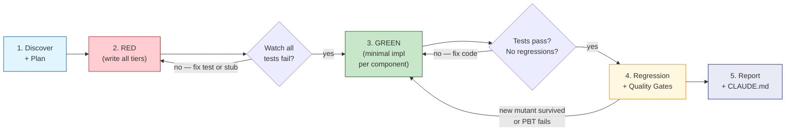

# TDD Implementing

Implements features and bug fixes using a strict test-driven development (TDD) workflow: tests first, then implementation.

**REQUIRED BACKGROUND:** Use superpowers:test-driven-development for the foundational discipline (RED-GREEN-REFACTOR philosophy, why order matters, anti-rationalization arguments). This skill operationalises that discipline into an executable phase pipeline with tiering, EDD, and reporting — but the *why* lives in the background skill.

<HARD-GATE>
## TDD Iron Laws

Non-negotiable. Violating any one means: delete code, start over.

- NO production code without a failing test first
- NO keeping "reference" implementations — delete means delete
- NO adapting existing code while writing tests
- NO skipping RED verification — watch every test fail
- NO skipping GREEN verification — watch every test pass
- NO modifying existing tests to make regressions pass — fix the code
- NO deploying LLM prompts or agentic routing without automated evals (EDD)
- NO batching task completion — mark each done immediately
- ALL required tiers in every /tdd invocation (unit + integration + regression; plus characterization/property/mutation/EDD when applicable)
- ZERO regressions allowed — full suite must pass before reporting complete
</HARD-GATE>

> **Violating the letter of the rules is violating the spirit of the rules.** Every "I'm following the spirit, not the ritual" argument is a rationalization. The rituals exist *because* spirit-only TDD silently degrades into tests-after.

## Core Principle

Write the test first. Watch it fail. Write minimal code to pass.

If you didn't watch the test fail, you don't know if it tests the right thing.

## Red-Green-Refactor

- **RED** — write one minimal failing test. Clear name, one behavior, real code
- **Verify RED** — run it. Confirm failure is from missing feature, not typos
- **GREEN** — simplest code to pass. Nothing more
- **Verify GREEN** — run the specific test file after each chunk
- **REFACTOR** — clean up only after green. No new behavior

## Local Development Principles

- **Hermeticity** — tests must never pollute local state. Use ephemeral directories, dynamic port binding, forced env var resets. No writing to project `./logs`, `./data`, `./tmp` — use system temp paths only
- **Exploration Stashing** — exploration code must be stashed (`git stash`) before writing tests. You cannot TDD against code you're simultaneously exploring. Explore → stash → RED
- **Contract-Verified Mocks (Tier 1.5)** — mocks must enforce signature matching against the real implementation. Prevents mocking methods that don't exist
- **Loopback Testing** — test integrations against local in-memory replicas (e.g., SQLite for Postgres) sharing the same schema as production

## Common Rationalizations

- **"Too simple to test"** → simple code breaks. Test takes 30 seconds
- **"I'll test after"** → tests passing immediately prove nothing
- **"Keep as reference"** → you'll adapt it. That's testing after. Delete means delete
- **"Need to explore first"** → fine. Throw away exploration, start with TDD
- **"TDD will slow me down"** → TDD + AI is faster than debugging
- **"AI already wrote good code"** → AI hallucinates regressions; tests are the guardrail
- **"Characterization tests are enough"** → they capture what it does, not what it should do
- **"Already manually tested it"** → ad-hoc ≠ systematic. No record, can't re-run, can't catch regressions
- **"Test hard to write = design unclear"** → listen to the test. Hard to test = hard to use. Simplify the interface, not the test
- **"Existing code has no tests, so this can skip too"** → you're improving it. Add tests for what you touch (boy-scout rule)
- **"Spirit, not ritual"** → see callout at top. Ritual *is* spirit; skipping the ritual is skipping the spirit
- **"User said move fast, so skip TDD"** → "move fast" means *execute the TDD cycle quickly*, not *skip it*. The ritual is the cadence, not the ceremony

## Red Flags — STOP and Start Over

When any of these appears, treat it as a TDD violation in progress:

- Code written before its test
- Test added "in the next commit"
- Test passes immediately (didn't watch it fail)
- Can't articulate what failure mode the test was meant to catch
- Mid-task thought: "this is different because..." / "just this once" / "I already validated it manually"
- About to modify an existing test to make it pass with new code (instead of fixing the new code)
- About to mark a task complete while a regression in the existing suite is unresolved
- About to deploy LLM/agentic routing with no eval golden set

**All of these mean: stop, delete the unverified code, restart at RED. The Iron Laws are not skipped under pressure.**

---

<HARD-GATE>
## Workflow Execution

Complete all phases in order. Each gates the next. Stopping early at any gate (e.g. shipping after GREEN without running the full regression suite) is a violation of the Iron Laws.


</HARD-GATE>

## Coverage Tiers

Every /tdd invocation must span the applicable tiers. Use this decision aid to pick which apply to your task:

```mermaid
flowchart TD
    start["Task type?"]
    legacy{Modifying<br/>legacy code<br/>without tests?}
    critical{On a critical path?<br/>(auth, money,<br/>encoding, parsing)}
    llm{Includes LLM<br/>prompt or<br/>agentic routing?}
    mocks{Mocking complex<br/>external interface?}
    base["Tiers 1 + 2 + 3<br/>(unit / integration / regression)<br/>— always required"]
    plus_t0["+ Tier 0 first<br/>(characterization)"]
    plus_t15["+ Tier 1.5<br/>(contract-verified mocks)"]
    plus_t4["+ Tier 4<br/>(PBT + mutation)"]
    plus_edd["+ EDD<br/>(golden set + scoring dims)"]

    start --> base
    base --> legacy
    legacy -->|yes| plus_t0
    legacy -->|no| mocks
    plus_t0 --> mocks
    mocks -->|yes| plus_t15
    mocks -->|no| critical
    plus_t15 --> critical
    critical -->|yes| plus_t4
    critical -->|no| llm
    plus_t4 --> llm
    llm -->|yes| plus_edd
```

Tiers 1, 2, and 3 are required for every task. Tiers 0, 1.5, 4, and EDD are conditional on the task shape above.

**Tier 0: Characterization Tests** (when modifying legacy code) — record existing behavior before changes. Capture current outputs as golden baselines. Answer "what does it do now?" Proper TDD tests still needed for "what should it do?"

**Tier 1: Unit Tests** (required) — test individual functions/methods in isolation. One behavior per test, no external dependencies (mock at system boundary), fast (<1s each).

**Tier 1.5: Contract-Verified Mocks** (when mocking complex interfaces) — mocks must fail if the real interface changes (new params, removed methods). Prevents "green tests, broken prod" from stale mocks. See language references for tool-specific patterns (autospec, vi.mocked, etc.).

**Tier 2: Integration Tests** (required) — test component interactions and data flow. Multiple components working together, verify contracts (X writes key Y, Z reads it), mock only at system boundary, test wiring. Loopback testing against local in-memory replicas.

**Tier 3: Regression Tests** (required) — prevent previously fixed bugs from returning. Edge cases that broke during development, backward compatibility, error paths, compile barrier as a test. Run FULL existing suite — zero regressions.

**Tier 4: Property-Based + Mutation Tests** (when on critical paths) — **PBT:** define invariants, bombard with generated edge cases (nulls, max values, unicode, empty collections). Example: `decode(encode(data)) == data`. **Mutation:** introduce deliberate faults (`==` to `!=`, swap `+` and `-`). If suite still passes, tests are blind. Target >90% kill rate on changed code.

---

## Eval-Driven Development (EDD)

When implementing non-deterministic AI/LLM components, binary pass/fail TDD is insufficient.

**When to use:** LLM prompt crafting, AI agent routing, RAG pipelines, summarization, classification with soft boundaries — any component where the same input can produce different valid outputs.

**Workflow:**
1. **Define the Oracle (RED)** — write evaluation criteria before the prompt/pipeline
2. **Golden Sets** — create 5-15 curated input/output pairs as regression baseline
3. **Scoring Dimensions** (continuous 0-100%, not binary) — correctness, relevance, hallucination, format, efficiency, safety
4. **Regression Gates (GREEN)** — define thresholds per dimension. A change that drops any dimension beyond threshold is a failure

**Report format:** `Golden set: N examples, M dimensions. Key scores: Accuracy 97%, Hallucination 1.2%. Regression gate: PASSED.`

---

## Mock Strategy

**Mock at the system boundary only.** Everything between the boundary and the assertion runs for real.

**Boundaries (mock these):** LLM/AI model calls, HTTP/network requests, subprocess/external CLI tools, file system when testing logic (not persistence tests).

**Real (never mock):** all internal logic, flows, state management, routing, persistence.

**Key principles:**
- Patch at the import site (where the function is used), not where it's defined
- Route mocks by content for multi-component flows
- Clean up module-level global state (debug flags, circuit breakers, singletons) after every test
- Contract-verified mocks (Tier 1.5) — mocks must match real interface signatures
- Hermetic state reset — any test modifying env vars, paths, or singletons must restore state even on failure
- No local artifacts — never write to project directories; use system temp paths only

**Language-specific patterns:** see `references/python-pytest.md`, `references/typescript-vitest.md`, `references/rust-cargo.md`

---

## Design Exploration Mode

When the task involves choosing between design options:

1. **Write test suites for ALL options** — test each independently, include PBT if applicable
2. **Implement ALL options** — each as standalone module, no integration yet
3. **Compare empirically** — run all suites. Report: passing tests, edge-case resilience, code surface, pattern fit, performance
4. **Wire the winner** — only after comparison, integrate the winning option

---

## Discovery Phase

Before writing tests:

**Source analysis:** read relevant source files, CLAUDE.md for contracts, existing test files (count tests, identify coverage gaps).

**Gap detection (classify each finding):**
- **EXTEND** — existing component missing a capability its interface supports
- **OPTIMIZE** — working code with a performance/correctness improvement
- **NEW** — functionality that requires a new component
- **WIRE** — existing component that works standalone but isn't integrated
- **CHARACTERIZE** — legacy code that needs baseline tests before modification

**External reference analysis:** read SDK docs/examples for API surfaces not yet used, cross-reference with current code, verify against live API before adopting.

**Live verification:** after mocked tests pass, verify against real endpoints when available. Mark live tests to auto-skip when backend is unavailable.

---

## Pattern → Test Shape Mapping

- **Strategy** → test dispatch, each strategy independently, unknown key raises
- **Factory** → created objects have correct type/config
- **Circuit breaker** → open/closed states, trip on failure, reset
- **Protocol** → all methods exist, implementations satisfy interface
- **Invariant** → `f(g(x)) == x` for all valid x (property-based)

---

<HARD-GATE>
## Execution

### Task Management

Use TaskCreate/TaskUpdate throughout. Break work into granular, trackable items.

- Create tasks BEFORE starting work — the plan IS the task list
- Mark each task `in_progress` when starting, `completed` when done — no batching
- One task per logical unit (one component, one test tier, one wiring step)
- If a task reveals sub-tasks, create them immediately
- Never mark a task complete until its verification step passes
</HARD-GATE>

### Phase 1: Discover + Plan

1. **Discover** — read source, docs, examples, existing tests (use parallel exploration agents for large codebases)
2. **Classify** — EXTEND/OPTIMIZE/NEW/WIRE/CHARACTERIZE findings
3. **Plan** — list tests across applicable tiers with one-line descriptions
4. **Create tasks:**
   - `RED: Write all tests` — write test file with stubs, verify ALL fail → complete after RED verification
   - `GREEN: [Component N]` — one per logical component → complete after its tests pass
   - `WIRE: [Integration]` — wire components, update exports → complete after integration tests pass
   - `Regression + CLAUDE.md` — full suite, compile barrier, doc update → complete after 0 regressions
   - For design exploration add: `GREEN: [Option A/B]`, `Compare + Wire winner`
   - For EDD add: `EDD: Define golden set`, `EDD: Verify scores`

### Phase 2: RED (Write All Tests)

Write all tests in ONE file. Group by tier. ALL must fail. Stub pattern: define stubs that raise `NotImplementedError`, replace with real imports once implemented. Mark RED task complete only after confirming all new tests fail.

### Phase 3: GREEN (Implement)

Minimal code per test. Run after each chunk. Mark each GREEN task complete as soon as its tests pass — don't wait for others. For design exploration: all options → compare → wire winner.

### Phase 4: Regression + Quality Gates

1. Full existing suite — zero failures
2. Property-based tests pass (if Tier 4)
3. Mutation testing — surviving mutants identified and killed (if Tier 4)
4. EDD golden set scores meet thresholds (if EDD)
5. Any regression = fix your code, NOT the existing test

### Phase 5: Report + Update

```
## TDD Complete: [FEATURE_NAME]

### Coverage
- Characterization: N (Tier 0, if applicable)
- Unit: M (Tier 1)
- Integration: K (Tier 2)
- Regression: P (Tier 3)
- Quality: Q mutations killed / R properties verified (Tier 4, if applicable)
- EDD: S dimensions scored (if applicable)
- Total new: sum
- Existing suite: X passed, 0 failed
```

<HARD-GATE>
After reporting, update CLAUDE.md if any of these changed: pipeline diagrams, module ownership, shared store keys, entry points, compile barrier, test suite, key constraints, dependencies.
</HARD-GATE>

---

## Verification Checklist

Before marking complete — ALL applicable boxes:

- [ ] Every new function/method has a unit test (Tier 1)
- [ ] Component contracts tested — writes verified by reads (Tier 2)
- [ ] Full composed flow tested end-to-end with mocked boundaries (Tier 2)
- [ ] Edge cases and error paths tested (Tier 3)
- [ ] Backward compatibility tested if format changed (Tier 3)
- [ ] Full existing suite passes — zero regressions (Tier 3)
- [ ] If legacy code: characterization tests captured before changes (Tier 0)
- [ ] If critical path: property invariants hold + mutations killed (Tier 4)
- [ ] If LLM component: golden set evals established and passed (EDD)
- [ ] Watched each test fail (RED) before implementing
- [ ] Wrote minimal code to pass (GREEN)
- [ ] Mocks only at system boundary with contract verification
- [ ] Global state cleanup via autouse fixtures
- [ ] No local artifacts — tests use temp paths only
- [ ] CLAUDE.md updated if architecture changed

Can't check all boxes? You skipped /tdd. Start over.

---

## When Stuck

Mid-RED, mid-GREEN, or mid-Regression failures often signal a deeper problem than "the test won't pass". Diagnose:

| Symptom | Likely cause | Action |
|---|---|---|
| Don't know how to write the test | Interface unclear | Write the wished-for API as the assertion first, then design the function around it |
| Test setup is huge (50+ lines) | Component takes too many deps | Extract collaborators behind injection points; hard-to-test = hard-to-use |
| Must mock 5+ things | Tight coupling | Stop. Refactor for DI before continuing the test |
| Test passes immediately on first run | Testing existing behavior, not new behavior | Delete; restart at RED with a stricter assertion that fails for the right reason |
| Test fails for a wrong reason (typo, import error) | Setup bug, not feature gap | Fix the test; do not call this RED — RED requires failing *because the feature is missing* |
| GREEN code grows to >50 LOC for one test | Either the test is too broad or the implementation is over-eager | Split the test into 2-3 smaller behaviors; write minimum for each |
| Existing-suite regression appears mid-implementation | New code breaks old contract | Fix the new code, not the old test. The Iron Laws forbid modifying existing tests to make regressions pass |
| "I want to refactor X while I'm here" | Boy-scout impulse mid-RED | Stash it. Do TDD on the current task; come back to the refactor as its own RED-GREEN cycle |
| LLM/eval scores degrade after a prompt change | Regression gate caught real degradation | Treat it like a test failure: revert or fix the prompt, never lower the threshold to make the gate pass |

---

## Related Skills

- **verify-before-application** — generalises RED-GREEN to non-code artifacts (plugin edits, schema migrations, refactor relocations, structural changes). When the artifact is a test, this skill (tdd) IS the gate. When the artifact is anything else, `verify-before-application` is the gate. Pair them; they share the same kernel.

## References (On-Demand Only)

- `references/python-pytest.md` — **load when** writing Python tests. pytest patterns, autospec mocks, hypothesis PBT, mutmut mutation testing, async test helpers
- `references/typescript-vitest.md` — **load when** writing TypeScript tests. vitest patterns, vi.mocked contracts, fast-check PBT, stryker mutation testing
- `references/rust-cargo.md` — **load when** writing Rust tests. `#[cfg(test)]` vs `tests/` vs doctests, mockall for Tier 1.5, proptest, insta snapshots, tokio::test, cargo-mutants, cargo-llvm-cov, cargo-fuzz, and the rust-specific CI speed patterns (nextest, `--test-threads=$(nproc)`, mold linker, sccache)
- `references/tdd-migration.md` — **load when** migrating or rewriting a codebase with TDD. Agent-orchestrated pipeline, parallel implementation agents, zero-context-growth orchestration
